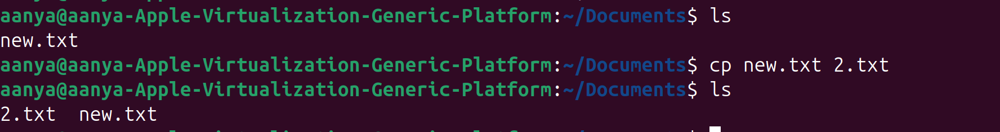
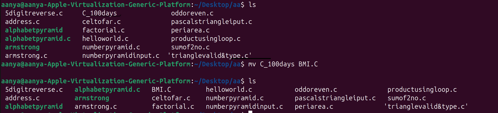

# Linux File Commands: `cp`, `mv`, and `touch`

## 1. `touch` Command

### 📌 Purpose:
Creates an empty file or updates the timestamp of an existing file.

### 🧪 Example:
```bash
touch file1.txt
````

This creates an empty file named `file1.txt` in the current directory.


---

## 2. `cp` Command

### 📌 Purpose:

Copies a file or directory.

### 🧪 Example:

```bash
cp file1.txt backup_file.txt
```

This creates a copy of `file1.txt` named `backup_file.txt` in the same directory.

### 🖼️ Visual Example:



---

## 3. `mv` Command

### 📌 Purpose:

Moves or renames files and directories.

### 🧪 Example: Moving one file to another folder

Assume you have a folder called `Documents` and a file `file1.txt`.

```bash
mv file1.txt Documents/
```

This moves `file1.txt` into the `Documents` folder.



