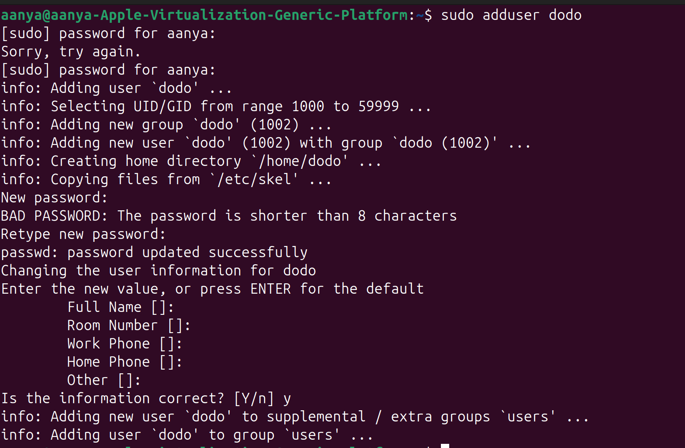

# Users and Groups
## ✅ 1. Users in Linux

A user in Linux represents an individual account, and each user can be assigned specific permissions to access files, execute programs, and interact with the system.

## Types of Users:

**Root User (Superuser)**

- Username: root
- ID: UID 0 (The user ID for root is always 0)
- Role: The most powerful user on the system. Has full control over the system, can modify anything, and execute any command.
- Privileges: Can access, modify, and delete any file, even system files.
**Normal User**

- Regular users who have access only to their files and certain system files.
- ID: Assigned a unique UID starting from 1000 (typically, depending on your Linux distribution).
- Role: Can execute commands, edit files, and access files in their home directories.
- Privileges: They are restricted by permissions (e.g., they can’t access or modify files owned by the root user unless granted explicit permission).
**System User**

- UID: Typically lower than 1000.
- Role: Used by system services and processes. These users don't log in directly, but are associated with daemons or background services like www-data (for web servers) or mysql (for the MySQL service).
- Privileges: Limited access for service operation purposes.
---
## ✅ 2. Groups in Linux

A group in Linux is a collection of users. By organizing users into groups, you can control access to files or directories that are shared among users of the same group. This makes managing permissions much easier.

**Types of Groups:**

_Primary Group_: Every user is assigned a primary group when created. This is the group that the user belongs to by default.

Example: If you create a user alice, the primary group might be alice as well, which is created automatically during user creation.
_Secondary Groups_: A user can belong to multiple groups. Secondary groups provide a way to grant additional access to specific resources.

For example, the user alice might also be part of the group developers, giving her additional access to certain files.
System Group Similar to system users, system groups are used for special purposes (e.g., service groups like www-data, mysql, etc.).
These groups often don’t have interactive logins and are associated with system processes.


---
## ✅ 3. Creating and Managing Users & Groups

- **Create a New User**

Use the adduser command to create a new user and assign it a home directory.
```bash
sudo adduser newuser
```

This will create a user named newuser and ask you to set a password and other details. The primary group for the user will also be created with the same name.

- **Create a New Group**

Use the groupadd command to create a new group.
```bash
sudo groupadd newgroup
```
This creates a new group newgroup on the system.

- **Assign a User to a Group**

To add a user to a group, you can use the usermod command.
```bash
sudo usermod -aG groupname username
```
Example:
```bash
sudo usermod -aG developers alice
```
This command adds alice to the developers group.

- **Change User's Primary Group**

To change a user's primary group, use the usermod command with the -g option.
```bash
sudo usermod -g newgroup username
```
Example:
```bash
sudo usermod -g admin bob
```
This will change bob's primary group to admin.

- **List All Users**

To list all users in the system:
```bash
cat /etc/passwd
```
This will show all user accounts on the system, including their home directories, login shells, and more.

- **List All Groups**

To list all groups:
```bash
cat /etc/group
```
This will display a list of groups on the system, including their associated users.


## ✅ 4. File Permissions and Groups

Linux permissions are often set based on users and groups. These permissions control who can read, write, or execute a file.

Example:
```bash
-rwxr-xr--
The first character indicates whether it's a file (-) or a directory (d).
The next three characters represent the owner's permissions.
The next three characters represent the group's permissions.
The last three characters represent other users' permissions.
```
**Changing Group Permissions**

To modify the group associated with a file or directory:
```bash
sudo chown :groupname file
```
Example:
```bash
sudo chown :developers file.txt
```
This changes the group associated with file.txt to the developers group.
---

## ✅ 5. Default Groups and User IDs (UIDs)

UID 0: Root user (root).
UID 1000 and higher: Regular users.
GID 0: Root group (the group associated with the root user).
GID > 1000: Normal groups created by users.
Viewing a User’s UID and GID
```bash
id username
```
Example:
```bash
id alice
```
This will show the UID, GID, and the groups that alice is part of.


## ✅ 6. Special Groups in Linux

*sudo or wheel group*: Members of this group have the ability to run commands as the root user using sudo.
*www-data*: The web server (e.g., Apache) often runs under this user and group.
*staff*: Common on macOS, often used to grant additional permissions to users.
*sudo or admin*: Users in these groups have administrative privileges.


## ✅ 7. Deleting Users and Groups

- Delete a User

To delete a user and their home directory:
```bash
sudo deluser --remove-home username
```
This deletes the user and removes their home directory.


- Delete a Group

To delete a group:
```bash
sudo delgroup groupname
```

## Summary

Users are individual accounts in Linux.

Root (UID 0) is the superuser with unrestricted access.
Regular users have limited permissions.
System users are used for specific processes or services.
Groups are collections of users. They allow for more efficient permission management.

Primary groups are assigned to each user by default.
Secondary groups give a user access to multiple shared resources.
Permissions for files and directories are assigned based on users and groups, and can be adjusted with commands like chmod and chown.