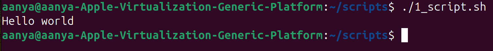
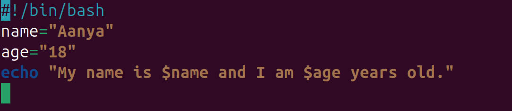
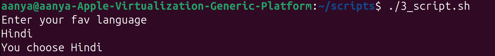
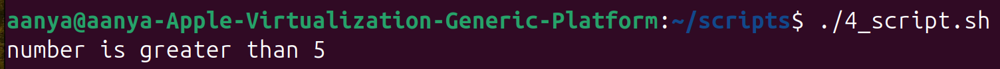
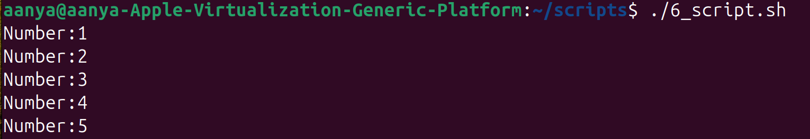
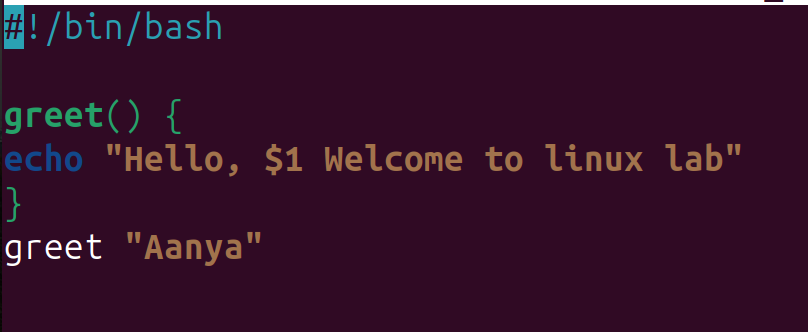
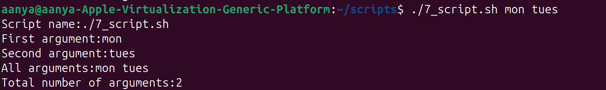

# 🐚 Shell Scripting Basics 

Shell scripting allows you to automate tasks in Linux/Unix by writing commands inside a file that the shell executes line by line.


## 1. 🔹 What is a Shell Script?
A shell is a command-line interpreter (e.g., bash, zsh, sh).
A shell script is a text file with a series of commands.
File usually has .sh extension, though not mandatory.
```bash
Example: 
hello.sh
#!/bin/bash
echo "Hello, World!"
```
Run it:
```bash
chmod +x hello.sh   # make it executable
./hello.sh
```


**Output:**


***

## 2. 🔹 Variables
Variables store data (text, numbers, paths, etc.).

### Defining variables
```bash
name="Aanya"
age=18
```
⚠️ No spaces around `=`.

### Accessing variables
```bash
echo "My name is $name and I am $age years old."
```

**Output:**


### Environment variables
```bash
echo $HOME   # home directory
echo $USER   # current user
echo $PWD    # present working directory
```
---

## 3. 🔹 User Input
Read input from user with read.
```bash
#!/bin/bash
echo "Enter your favorite language:"
read lang
echo "You chose $lang"
```
Output:

---

## 4. 🔹 Conditional Statements (if-else)
```bash
#!/bin/bash
num=10

if [ $num -gt 5 ]; then
    echo "Number is greater than 5"
else
    echo "Number is less than or equal to 5"
fi
```
Output:

### Operators:

- eq (equal)
- ne (not equal)
- gt (greater than)
- lt (less than)
- ge (greater or equal)
- le (less or equal)
---
## 5. 🔹 Loops
### For loop
```bash
for i in 1 2 3 4 5
do
    echo "Number: $i"
done
```
Or use a range:
```bash
for i in {1..5}
do
    echo "Iteration $i"
done
```
### While loop
```bash
count=1
while [ $count -le 5 ]
do
    echo "Count: $count"
    ((count++))   # increment
done
```
### Until loop
Runs until condition becomes true.
```bash
x=1
until [ $x -gt 5 ]
do
    echo "Value: $x"
    ((x++))
done
```
Output:

## 6. 🔹 Functions
Encapsulate reusable code.
```bash
greet() {
echo "Hello, $1 Welcome to linux lab"
}
greet "Aanya"
```

Output:
```bash
Hello, Aanya Welcome to linux lab
```
---
## 7. 🔹 Command Line Arguments
Access arguments passed to script:
```bash
#!/bin/bash
echo "Script name: $0"
echo "First argument: $1"
echo "Second argument: $2"
echo "All arguments: $@"
echo "Number of arguments: $#"
```
Run:
```bash
./7_script.sh mon tues
```
Output:
```bash
Script name: ./7_script.sh
First argument: mon
Second argument: tues
All arguments: mon tues
Number of arguments: 2
```

---
