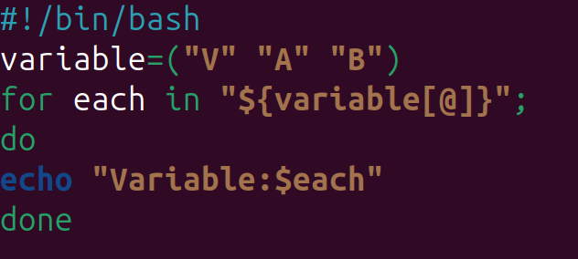
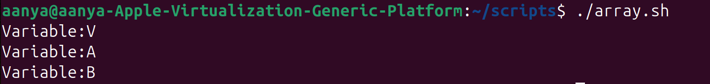
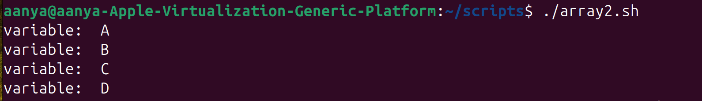
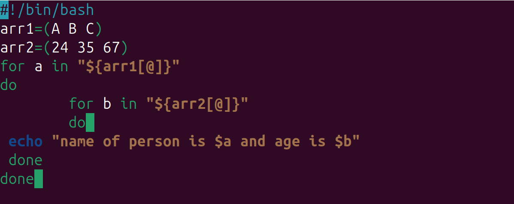
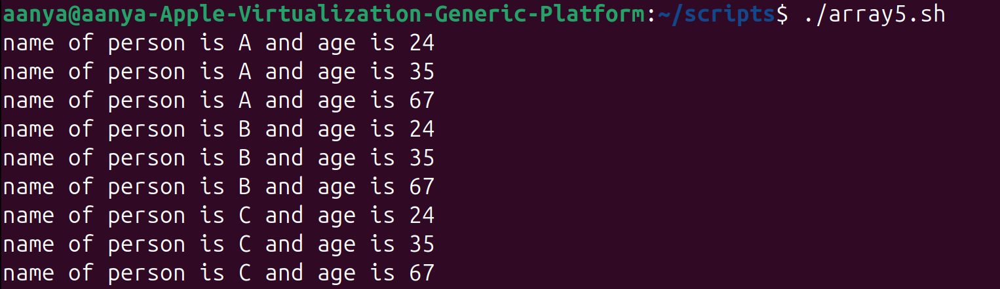
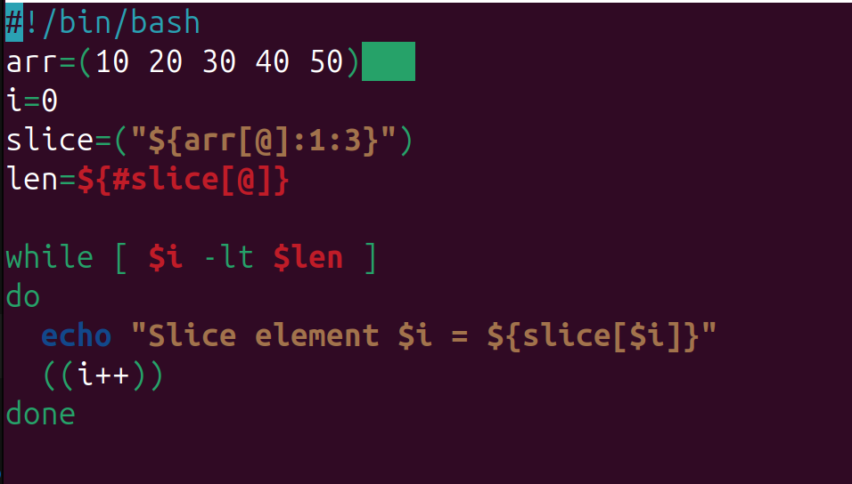
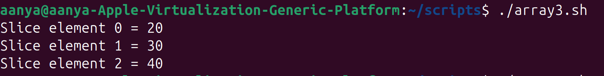
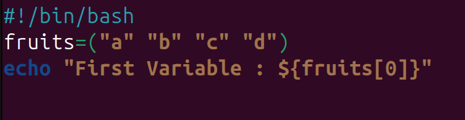
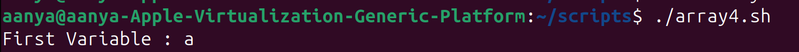

# Arrays
## 1.What is an Array?

An array is a variable that can hold multiple values at the same time.

Example: Instead of creating 5 variables, you can store all values in one array.

## 2.Declaring Arrays and Printing 

Output:

---
## 3.Loop Through Arrays
### While Loop

Output:

### For Loop

Output:

---
## 4.Slicing in Arrays

Output:

Output:
