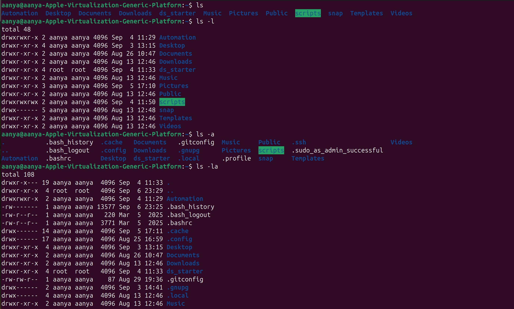

# Linux Basic Commands
## ✅ 1. Navigation Commands
### `pwd` – Print Working Directory
Shows the current location in the filesystem.
```bash
pwd
```

📌 Output example:

### `ls` – List Directory Contents
Lists files and folders in the current directory.
```bash
ls
```

```bash
ls -l → Detailed list (permissions, size, date)
ls -a → Shows hidden files (those starting with .)
ls -la → Combined
```


### `cd` – Change Directory
Moves into a directory.
```bash
cd folder_name
```
Examples:
```bash
cd Documents        # Go to Documents
cd ..               # Go up one level
cd /                # Go to root
cd ~                # Go to home directory
```


## ✅ 2. File and Directory Management
mkdir – Make Directory
Creates a new folder.
```bash
mkdir new_folder
```

### `touch` – Create File
Creates an empty file.
```bash
touch file.txt
```


### `cp` – Copy Files or Directories
```bash
cp source.txt destination.txt
```
* Copy folder:
```bash
cp -r folder1 folder2
```


### `mv` – Move or Rename Files
```bash
mv oldname.txt newname.txt
mv file.txt ~/Documents/     # Move file
rm – Remove Files
rm file.txt          # Delete file
rm -r folder_name    # Delete folder (recursively)
```


⚠️ Be careful! There is no undo.

## ✅ 3. File Viewing & Editing
### `cat` – View File Contents
Displays content in terminal.
```bash
cat file.txt
```

### `nano` – Edit Files in Terminal
A basic terminal-based text editor.
```bash
nano file.txt
```

Use arrows to move
- `CTRL + O` to save
- `CTRL + X` to exit
- `clear` – Clears the Terminal
Shortcut: `CTRL + L`

## ✅ 4. System Commands
### echo – Print Text
Useful for debugging or scripting.

```bash
echo "Hello, World!"
```
`whoami` – Show Current User
```bash
whoami
```
`man` – Manual for Any Command
```bash
man ls
```
Use q to quit the manual.

## ✅ 5. Searching and Finding
`find` – Locate Files
```bash
find . -name "*.txt"
```
🔍 Finds all .txt files in current folder and subfolders.

`grep` – Search Inside Files
```bash
grep "hello" file.txt
```
🔍 Searches for the word hello inside file.txt.

## ✅ 6. Helpful Shortcuts
Shortcut	Action
Tab	Auto-complete files/folders
↑ / ↓	Browse command history
CTRL + C	Stop a running command
CTRL + L	Clear screen

## ✅ 7. Bonus: Chaining Commands
Run multiple commands:
```bash
mkdir test && cd test && touch hello.txt
```
Run only if previous command succeeds: `&&`
Run regardless of success: `;`
