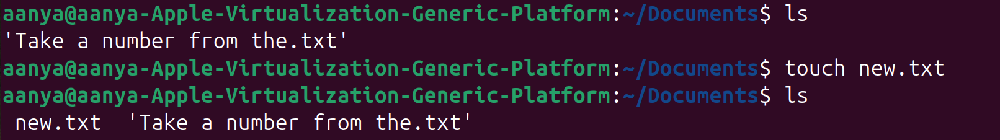
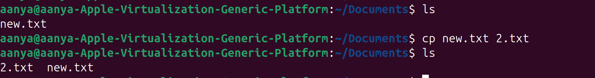
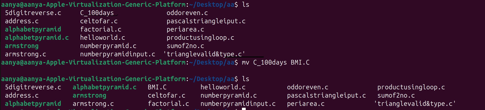

# LAB-1 LINUX BASICS
## Lab files chosen
`Lab3-Basic_Commands.md`

## Lab3-Basic_Commands.md


### ✅ 1. **Navigation Commands**

#### `pwd` – Print Working Directory

Shows the current location in the filesystem.

```bash
pwd
```

📌 Output example:
```bash
/Users/aanya./Desktop/Linux_Lab-main
```
---

### `ls` – List Directory Contents

Lists files and folders in the current directory.

```bash
ls
```

* `ls -l` → Detailed list (permissions, size, date)
* `ls -a` → Shows hidden files (those starting with `.`)
* `ls -la` → Combined

📌 Output example:
```bash
assignments                     Lab3_SudoAdmin.md               Lab3-BasicLinuxCommands.md      Lab5-Exp1.md                    Lab7.md
images                          Lab3_UserGroupAccess.md         Lab4-Exp1.md                    Lab6-Exp1.md                    README.md
```
---

### `cd` – Change Directory

Moves into a directory.

```bash
cd folder_name
```

Examples:

```bash
cd Documents        # Go to Documents
cd ..               # Go up one level
cd /                # Go to root
cd ~                # Go to home directory
```

---

## ✅ 2. **File and Directory Management**

### `mkdir` – Make Directory

Creates a new folder.

```bash
mkdir new_folder
```

---

### `touch` – Create File

Creates an empty file.

```bash
touch file.txt
```
📌Output example:

---

### `cp` – Copy Files or Directories

```bash
cp source.txt destination.txt
```

* Copy folder:

```bash
cp -r folder1 folder2
```

---

### `mv` – Move or Rename Files

```bash
mv oldname.txt newname.txt
```

```bash
mv file.txt ~/Documents/     # Move file
```
📌Output example:

---

### `rm` – Remove Files

```bash
rm file.txt          # Delete file
rm -r folder_name    # Delete folder (recursively)
```
📌Output example:

⚠️ **Be careful!** There is no undo.

---

## ✅ 3. **File Viewing & Editing**

### `cat` – View File Contents

Displays content in terminal.

```bash
cat file.txt
```

---

### `nano` – Edit Files in Terminal

A basic terminal-based text editor.

```bash
nano file.txt
```

* Use arrows to move
* `CTRL + O` to save
* `CTRL + X` to exit

---

### `clear` – Clears the Terminal

```bash
clear
```

Shortcut: `CTRL + L`

---

## ✅ 4. **System Commands**

### `echo` – Print Text

Useful for debugging or scripting.

```bash
echo "Hello, World!"
```
Output:
```bash
Hello, World!
```
---

### `whoami` – Show Current User

```bash
whoami
```
📌Output example:
```bash
aanya.
```
---

### `man` – Manual for Any Command

```bash
man ls
```

Use `q` to quit the manual.

---

## ✅ 5. **Searching and Finding**

### `find` – Locate Files

```bash
find . -name "*.md"
```

🔍 Finds all `.md` files in current folder and subfolders.

---
📌Output example:
```bash
./assignments/Lab0.md
./assignments/Lab1.md
./assignments/Lab2.md
./assignments/Lab3.md
./README.md
./Lab6-Exp1.md
./Lab7.md
./Lab3_SudoAdmin.md
./Lab3-BasicLinuxCommands.md
./Lab5-Exp1.md
./Lab3_UserGroupAccess.md
./Lab4-Exp1.md
```
### `grep` – Search Inside Files

```bash
grep "hello" file.txt
```

🔍 Searches for the word `hello` inside `file.txt`.

---

## ✅ 6. **Helpful Shortcuts**

| Shortcut   | Action                      |
| ---------- | --------------------------- |
| `Tab`      | Auto-complete files/folders |
| `↑ / ↓`    | Browse command history      |
| `CTRL + C` | Stop a running command      |
| `CTRL + L` | Clear screen                |

---

## ✅ 7. **Bonus: Chaining Commands**

* **Run multiple commands**:

```bash
mkdir test && cd test && touch hello.txt
```

* **Run only if previous command succeeds**: `&&`
* **Run regardless of success**: `;`

---


## Lab6_Shell_Scripting_Basics.md

### 1️⃣ hello.sh
**Code:**
```bash
#!/bin/bash
echo "Hello, World!"
```
**Output:**
```bash
Hello, World!
```
---
### 2️⃣ Variables
**Code:**
```bash
name="Aanya"
age=18
echo "My name is $name and I am $age years old."
```

**Output:**
```bash
My name is Aanya and I am 18 years old.
```
---
### 3️⃣ User Input
**Code:**

```bash
#!/bin/bash
echo "Enter your favorite language:"
read lang
echo "You chose $lang"
```

**Output:**
```bash
Enter your favourite language
Hindi
You chose Hindi
```
---
### 4️⃣ Conditional Statements (if-else)
**Code:**
```bash
#!/bin/bash
num=10

if [ $num -gt 5 ]; then
    echo "Number is greater than 5"
else
    echo "Number is less than or equal to 5"
fi
```

**Output:**
```bash
Number is greater than 5
```
---

### 5️⃣ Loops

**Code:**
```bash
for i in 1 2 3 4 5
do
    echo "Number: $i"
done
```

**Output:**
```bash
Number: 1
Number: 2
Number: 3
Number: 4
Number: 5
```
---
### 6️⃣ Functions
**Code:**
```bash
greet() {
echo "Hello, $1 Welcome to linux lab"
}
greet "Aanya"
```

**Output:**
```bash
Hello, Aanya Welcome to linux lab
```
---
### 7️⃣ Command Line Arguments
**Code:**
```bash
#!/bin/bash
echo "Script name: $0"
echo "First argument: $1"
echo "Second argument: $2"
echo "All arguments: $@"
echo "Number of arguments: $#"
```

**Run:**
```bash
./cmndline.sh mon tues
```

**Output:**
```bash
Script name: cmndline.sh
First argument: mon
Second argument: tues
All arguments: mon tues
Number of arguments: 2
```
---

## Extra Questions
### 1️⃣ What is the difference between `chmod` and `chown`?
🔑 1. Difference between chmod and chown
`chmod` → Change file permissions

Controls what actions (read, write, execute) users can do on a file/directory.

Example:
```bash
chmod 755 script.sh
```

* Owner: read/write/execute
 
* Group: read/execute

* Others: read/execute

---

`chown` → Change file owner

Controls who owns a file or directory.

Example:
```bash
chown alice:developers script.sh
```

Owner becomes alice.

Group becomes developers.

---
### 📂 2. How to check current directory

Use:
```bash
pwd
```

→ Prints the Present Working Directory.

Example:
```bash
/home/username/projects
```
---
### 👤 3. How to check current user

Use:
```bash
whoami
```

→ Prints the username of the current user.

Example:
```bash
aanya
```

You can also use:
```bash
id
```

→ Shows username, user ID, group ID, and group memberships.