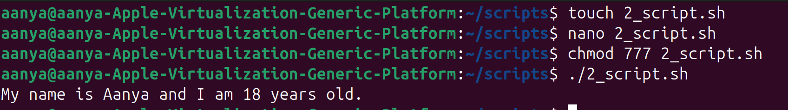

# LAB-2 SCRIPT EXECUTION & EXPLANATION
## 📝 Scripts Chosen
| Script          | Purpose     |
|--------         |------------ |
| first.sh        |  To demonstrate how to write and run a simple Bash script.  |
| array_loop.sh   | To demonstrate how to use arrays in Bash.    |

### 1️⃣ Code 1-
```bash
#!/bin/bash 

colors=("red" "green" "blue") 
for color in "${colors[@]}" 
do
  echo "Color: $color"
done
```
#### Meaning-
📝 Step by step

`#!/bin/bash` → Shebang, tells the system to use Bash.

`colors=("red" "green" "blue")` → Declares an array named colors with 3 elements: "red", "green", "blue".

`for color in "${colors[@]}"` → A for loop that goes through each element in the array.

`${colors[@]}` expands to all elements of the array.

Each time, the variable color takes one value (red, then green, then blue).

`do ... done` → Loop body. Inside it, we run:
```bash
echo "Color: $color"
```

Which prints each color with the prefix "Color:".


### 1️⃣ Output 1-


---
### 2️⃣ Code 2-
```bash
#!/bin/bash
echo "Hello, World!"
name="Aanya"
age=18

echo "My name is $name and I am $age years old."wq
```
#### Meaning-

**1.** `#!/bin/bash` → This is the shebang line. It tells the system to run the script using the Bash shell.

**2.** `echo "Hello, World!"` → Prints the classic “Hello, World!” message.

**3.** `name="Aanya"` and `age=18` → Define two variables:

* name stores the string "Aanya"

* age stores the number 18

**4.** `echo "My name is $name and I am $age years old."` → Prints a sentence that uses the variables.

`$name` and `$age` are expanded to their values.

### 2️⃣ Output 2-


---

## Extra Questions

### What is the purpose of #!/bin/bash at the top of a script?
* This is called the **shebang (#!)**.

* It tells the operating system which interpreter to use when running the script.

* In this case:

- `#!/bin/bash` → use the Bash shell to run the commands.

- Without it, the script might run in another shell (like `sh`, `dash`, or `zsh`), and some Bash-specific features may not work.

### How to make a script executable?

**1.** Save the script.

**2.** Open a terminal in that directory.

**3.** Run this command:
```bash
chmod +x myscript.sh
```
* chmod = change file permissions
* +x = add "execute" permission

**4.** Now you can run it as:
```bash
./myscript.sh
```
     
