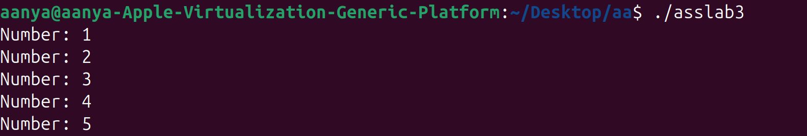

# LAB-3
## Script Chosen
`print_numbers.sh`
### Original Code
```bash
#!/bin/bash

for i in 1 2 3 4 5
do
  echo "Number: $i"
done
```
### Original Output


## Modifying Script
Modify script so that:

* User provides start, end, and step values as input.

* Script validates inputs (e.g., step must be positive).

### New Code
```bash
#!/bin/bash

# Ask for user input
read -p "Enter start value: " start
read -p "Enter end value: " end
read -p "Enter step value: " step

# Validate that step is positive
if [ "$step" -le 0 ]; then
  echo "Error: Step must be a positive number."
  exit 1
fi

# Print numbers in the given range
for (( i=start; i<=end; i+=step ))
do
  echo "Number: $i"
done
```
### New Output
