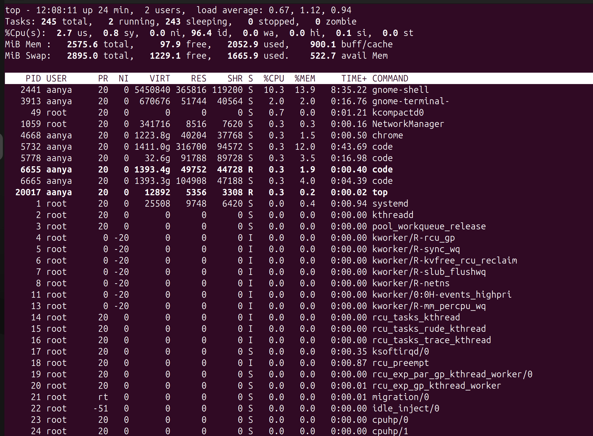
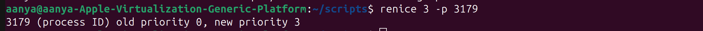
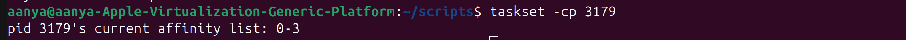
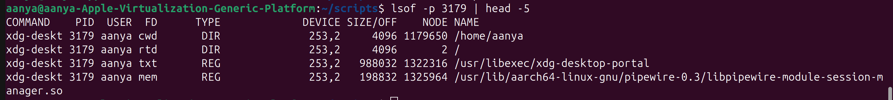
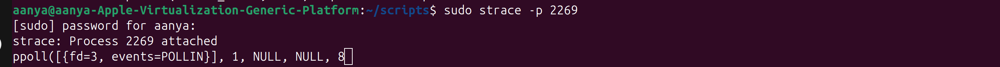
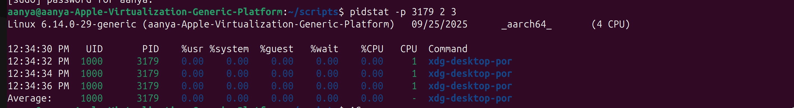

# Linux Process Management
## 1. Adjusting Process Priority 
```bash
ps aux
```

* The `ps aux` command is one of the most frequently used commands in Linux for monitoring and troubleshooting. It provides a static snapshot of all running processes on your system.

* The aux part consists of three different options in the BSD style of the ps command:

- `a`: Shows processes for all users (not just the current user).

- `u`: Displays the output in a user-oriented format, providing more detail like CPU and memory usage.

- `x`: Includes processes not attached to a terminal (daemon processes, background services, etc.).

* Key Columns in ps aux Output
The command produces a detailed table with information about each process. Here are the most important columns:
```bash
Column	Description
`USER`	The username of the process owner.
`PID`	The unique Process ID. Used with commands like kill and renice.
`%CPU`	The percentage of CPU time the process is currently using.
`%MEM`	The percentage of physical memory (RAM) the process is currently using.
`VSZ`	Virtual Memory Size (in KiB). The total virtual memory the process is using.
`RSS`	Resident Set Size (in KiB). The actual physical memory (RAM) the process is holding that is not swapped out.
`TTY`	The controlling terminal. A ? means the process is not attached to a terminal (daemon/service).
`STAT`	The Process State Code. Common codes include: R (Running), S (Sleeping/waiting), Z (Zombie/defunct), T (Stopped).
`START`	The time or date the command started.
`TIME`	The cumulative CPU time the process has consumed.
`COMMAND`	The full command line that started the process, including arguments.
```

Example Output:
```bash

USER         PID %CPU %MEM    VSZ   RSS TTY      STAT START   TIME COMMAND
root           1  0.1  0.3  25508 10004 ?        Ss   11:43   0:00 /sbin/init sp
root           2  0.0  0.0      0     0 ?        S    11:43   0:00 [kthreadd]
root           3  0.0  0.0      0     0 ?        S    11:43   0:00 [pool_workque
root           4  0.0  0.0      0     0 ?        I<   11:43   0:00 [kworker/R-rc
root           5  0.0  0.0      0     0 ?        I<   11:43   0:00 [kworker/R-sy
root           6  0.0  0.0      0     0 ?        I<   11:43   0:00 [kworker/R-kv
root           7  0.0  0.0      0     0 ?        I<   11:43   0:00 [kworker/R-sl
root           8  0.0  0.0      0     0 ?        I<   11:43   0:00 [kworker/R-ne
root          10  0.0  0.0      0     0 ?        I    11:43   0:00 [kworker/0:1-
root          11  0.0  0.0      0     0 ?        I<   11:43   0:00 [kworker/0:0H
root          13  0.0  0.0      0     0 ?        I<   11:43   0:00 [kworker/R-mm
root          14  0.0  0.0      0     0 ?        I    11:43   0:00 [rcu_tasks_kt
root          15  0.0  0.0      0     0 ?        I    11:43   0:00 [rcu_tasks_ru
root          16  0.0  0.0      0     0 ?        I    11:43   0:00 [rcu_tasks_tr
root          17  0.0  0.0      0     0 ?        S    11:43   0:00 [ksoftirqd/0]
root          18  0.0  0.0      0     0 ?        I    11:43   0:00 [rcu_preempt]
root          19  0.0  0.0      0     0 ?        S    11:43   0:00 [rcu_exp_par_
root          20  0.0  0.0      0     0 ?        S    11:43   0:00 [rcu_exp_gp_k
root          21  0.0  0.0      0     0 ?        S    11:43   0:00 [migration/0]
root          22  0.0  0.0      0     0 ?        S    11:43   0:00 [idle_inject/
root          23  0.0  0.0      0     0 ?        S    11:43   0:00 [cpuhp/0]
root          24  0.0  0.0      0     0 ?        S    11:43   0:00 [cpuhp/1]
root          25  0.0  0.0      0     0 ?        S    11:43   0:00 [idle_inject/
root          26  0.0  0.0      0     0 ?        S    11:43   0:00 [migration/1]
root          27  0.0  0.0      0     0 ?        S    11:43   0:00 [ksoftirqd/1]
root          29  0.0  0.0      0     0 ?        I<   11:43   0:00 [kworker/1:0H
root          30  0.0  0.0      0     0 ?        S    11:43   0:00 [cpuhp/2]
root          31  0.0  0.0      0     0 ?        S    11:43   0:00 [idle_inject/
root          32  0.0  0.0      0     0 ?        S    11:43   0:00 [migration/2]
root          33  0.0  0.0      0     0 ?        S    11:43   0:00 [ksoftirqd/2]
root          35  0.0  0.0      0     0 ?        I<   11:43   0:00 [kworker/2:0H
root          36  0.0  0.0      0     0 ?        S    11:43   0:00 [cpuhp/3]
root          37  0.0  0.0      0     0 ?        S    11:43   0:00 [idle_inject/
root          38  0.0  0.0      0     0 ?        S    11:43   0:00 [migration/3]
root          39  0.0  0.0      0     0 ?        S    11:43   0:00 [ksoftirqd/3]
root          41  0.0  0.0      0     0 ?        I<   11:43   0:00 [kworker/3:0H
root          42  0.0  0.0      0     0 ?        S    11:43   0:00 [kdevtmpfs]
root          43  0.0  0.0      0     0 ?        I<   11:43   0:00 [kworker/R-in
root          44  0.0  0.0      0     0 ?        S    11:43   0:00 [kauditd]
root          45  0.0  0.0      0     0 ?        S    11:43   0:00 [khungtaskd]
root          46  0.0  0.0      0     0 ?        I    11:43   0:00 [kworker/u16:
root          47  0.0  0.0      0     0 ?        S    11:43   0:00 [oom_reaper]
root          48  0.0  0.0      0     0 ?        I<   11:43   0:00 [kworker/R-wr
root          49  0.0  0.0      0     0 ?        S    11:43   0:00 [kcompactd0]
root          50  0.0  0.0      0     0 ?        SN   11:43   0:00 [ksmd]
root          51  0.0  0.0      0     0 ?        SN   11:43   0:00 [khugepaged]
root          52  0.0  0.0      0     0 ?        I<   11:43   0:00 [kworker/R-ki
root          53  0.0  0.0      0     0 ?        I<   11:43   0:00 [kworker/R-kb
root          54  0.0  0.0      0     0 ?        I<   11:43   0:00 [kworker/R-bl
root          56  0.0  0.0      0     0 ?        I    11:43   0:00 [kworker/1:1-
root          57  0.0  0.0      0     0 ?        I<   11:43   0:00 [kworker/R-tp
root          58  0.0  0.0      0     0 ?        I<   11:43   0:00 [kworker/R-at
root          59  0.0  0.0      0     0 ?        I<   11:43   0:00 [kworker/R-md
root          60  0.0  0.0      0     0 ?        I<   11:43   0:00 [kworker/R-md
root          61  0.0  0.0      0     0 ?        I<   11:43   0:00 [kworker/R-ed
root          62  0.0  0.0      0     0 ?        I<   11:43   0:00 [kworker/R-de
root          63  0.0  0.0      0     0 ?        S    11:43   0:00 [watchdogd]
root          65  0.0  0.0      0     0 ?        I<   11:43   0:00 [kworker/1:1H
root          66  0.3  0.0      0     0 ?        S    11:43   0:02 [kswapd0]
root          67  0.0  0.0      0     0 ?        S    11:43   0:00 [ecryptfs-kth
root          68  0.0  0.0      0     0 ?        I<   11:43   0:00 [kworker/R-kt
root          69  0.0  0.0      0     0 ?        I<   11:43   0:00 [kworker/u17:
root          70  0.0  0.0      0     0 ?        I<   11:43   0:00 [kworker/R-ac
root          71  0.0  0.0      0     0 ?        I    11:43   0:00 [kworker/u16:
root          72  0.0  0.0      0     0 ?        I<   11:43   0:00 [kworker/R-ml
root          73  0.0  0.0      0     0 ?        I<   11:43   0:00 [kworker/R-ip
root          76  0.0  0.0      0     0 ?        I    11:43   0:00 [kworker/u16:
root          82  0.0  0.0      0     0 ?        I<   11:43   0:00 [kworker/R-ks
root          96  0.0  0.0      0     0 ?        I<   11:43   0:00 [kworker/R-ch
root          97  0.0  0.0      0     0 ?        S    11:43   0:00 [irq/13-ACPI:
root          98  0.0  0.0      0     0 ?        I<   11:43   0:00 [kworker/0:1H
root         121  0.0  0.0      0     0 ?        I<   11:43   0:00 [kworker/3:1H
root         126  0.0  0.0      0     0 ?        I    11:43   0:00 [kworker/3:3-
root         150  0.0  0.0      0     0 ?        I<   11:43   0:00 [kworker/2:1H
root         152  0.0  0.0      0     0 ?        S    11:43   0:00 [hwrng]
root         216  0.0  0.0      0     0 ?        S    11:43   0:00 [scsi_eh_0]
root         217  0.0  0.0      0     0 ?        I<   11:43   0:00 [kworker/R-sc
root         218  0.0  0.0      0     0 ?        S    11:43   0:00 [usb-storage]
root         219  0.0  0.0      0     0 ?        I<   11:43   0:00 [kworker/R-ua
root         220  0.0  0.0      0     0 ?        I    11:43   0:00 [kworker/2:2-
root         257  0.0  0.0      0     0 ?        S    11:43   0:00 [jbd2/vda2-8]
root         258  0.0  0.0      0     0 ?        I<   11:43   0:00 [kworker/R-ex
root         305  0.0  0.0      0     0 ?        I    11:43   0:00 [kworker/0:2-
root         312  0.0  0.5  59684 14496 ?        S<s  11:43   0:00 /usr/lib/syst
systemd+     328  0.0  0.1  17596  4960 ?        Ss   11:43   0:00 /usr/lib/syst
systemd+     367  0.0  0.3  22948  8156 ?        Ss   11:43   0:00 /usr/lib/syst
systemd+     368  0.0  0.1  91256  5020 ?        Ssl  11:43   0:00 /usr/lib/syst
root         377  0.0  0.1  38692  5072 ?        Ss   11:43   0:00 /usr/lib/syst
root         381  0.0  0.0      0     0 ?        S    11:43   0:00 [psimon]
root         649  0.0  0.0      0     0 ?        I    11:43   0:00 [kworker/u16:
avahi        964  0.0  0.1   6568  3088 ?        Ss   11:43   0:00 avahi-daemon:
message+     965  0.0  0.2  11896  5332 ?        Ss   11:43   0:00 @dbus-daemon 
gnome-r+     970  0.0  0.3 523396  8308 ?        Ssl  11:43   0:00 /usr/libexec/
polkitd      977  0.0  0.3 389832  8288 ?        Ssl  11:43   0:00 /usr/lib/polk
root         984  0.6  1.0 1995796 27964 ?       Ssl  11:43   0:04 /usr/lib/snap
root         987  0.0  0.2 312156  6440 ?        Ssl  11:43   0:00 /usr/libexec/
root         988  0.0  0.0   9560  2360 ?        Ss   11:43   0:00 /usr/sbin/cro
root         989  0.0  0.2 311008  5932 ?        Ssl  11:43   0:00 /usr/libexec/
root         993  0.0  0.2  18412  5600 ?        Ss   11:43   0:00 /usr/lib/syst
root         995  0.0  0.2 473756  7724 ?        Ssl  11:43   0:00 /usr/libexec/
avahi       1011  0.0  0.0   6380  1456 ?        S    11:43   0:00 avahi-daemon:
syslog      1052  0.0  0.1 220832  3248 ?        Ssl  11:43   0:00 /usr/sbin/rsy
root        1059  0.0  0.4 341716 10696 ?        Ssl  11:43   0:00 /usr/sbin/Net
root        1062  0.0  0.1  16900  3316 ?        Ss   11:43   0:00 /usr/sbin/wpa
root        1128  0.0  0.2 397028  5900 ?        Ssl  11:43   0:00 /usr/sbin/Mod
root        1262  0.0  0.2  35408  6440 ?        Ss   11:43   0:00 /usr/sbin/cup
root        1264  0.0  0.0   2316  1240 ?        Ss   11:43   0:00 /bin/sh /snap
root        1265  0.0  0.0   2316  1144 ?        Ss   11:43   0:00 /bin/sh /snap
root        1276  0.0  0.2 123744  7200 ?        Ssl  11:43   0:00 /usr/bin/pyth
lp          1300  0.0  0.1  16152  3664 ?        S    11:43   0:00 /usr/lib/cups
root        1303  0.0  0.2 314240  6696 ?        Ssl  11:43   0:00 /usr/sbin/gdm
cups-br+    1312  0.0  0.3 210396 10276 ?        Ssl  11:43   0:00 /usr/sbin/cup
root        1497  0.0  0.1  62692  2892 ?        S    11:43   0:00 cupsd -f -s /
root        1498  0.0  0.0 242012  2552 ?        Sl   11:43   0:00 cups-proxyd /
root        1501  0.0  0.0   2316   560 ?        S    11:43   0:00 /bin/sh /snap
root        1502  0.0  0.0   2632  1464 ?        S    11:43   0:00 sleep 3600
root        1537  0.0  0.0      0     0 ?        S    11:43   0:00 [psimon]
rtkit       1586  0.0  0.0  21364  2412 ?        SNsl 11:43   0:00 /usr/libexec/
colord      1721  0.0  0.2 320020  7100 ?        Ssl  11:43   0:00 /usr/libexec/
root        1771  0.0  0.2 321636  7344 ?        Ssl  11:43   0:00 /usr/libexec/
root        1993  0.0  0.2 312464  5720 ?        Ssl  11:43   0:00 /usr/libexec/
root        2055  0.0  0.1  93488  4424 ?        Ssl  11:43   0:00 /usr/sbin/spi
root        2160  0.0  0.2 178644  6328 ?        Sl   11:44   0:00 gdm-session-w
aanya       2168  0.0  0.3  23084  8208 ?        Ss   11:44   0:00 /usr/lib/syst
aanya       2169  0.0  0.0  23728  2356 ?        S    11:44   0:00 (sd-pam)
aanya       2182  0.0  0.1   7272  2908 ?        Ss   11:44   0:00 /usr/bin/mpri
aanya       2183  0.0  0.1 172372  4568 ?        S<sl 11:44   0:00 /usr/bin/pipe
aanya       2185  0.0  0.1  87604  3424 ?        Ssl  11:44   0:00 /usr/bin/pipe
aanya       2187  0.0  0.1  41400  3916 ?        Ss   11:44   0:00 /snap/snapd-d
aanya       2188  0.0  0.2 486580  7856 ?        S<sl 11:44   0:00 /usr/bin/wire
aanya       2192  0.0  0.3 182528 10508 ?        S<sl 11:44   0:00 /usr/bin/pipe
aanya       2200  0.0  0.1  10224  4820 ?        Ss   11:44   0:00 /usr/bin/dbus
aanya       2205  0.0  0.2 186136  6512 ?        SLsl 11:44   0:00 /usr/bin/gnom
aanya       2247  0.0  0.2 171072  5432 tty2     Ssl+ 11:44   0:00 /usr/libexec/
aanya       2257  0.0  0.3 202108  8120 tty2     Sl+  11:44   0:00 /usr/libexec/
aanya       2269  0.0  0.2 684772  7000 ?        Ssl  11:44   0:00 /usr/libexec/
aanya       2306  0.0  0.2 310296  5712 ?        Ssl  11:44   0:00 /usr/libexec/
root        2320  0.0  0.0   2356  1524 ?        Ss   11:44   0:00 fusermount3 -
aanya       2360  0.0  0.1  97688  5076 ?        Ssl  11:44   0:00 /usr/libexec/
aanya       2361  0.0  0.1  90168  4388 ?        Ssl  11:44   0:00 /usr/libexec/
aanya       2379  0.0  0.2 315864  6404 ?        Ssl  11:44   0:00 /usr/libexec/
aanya       2401  0.0  0.2 395544  5916 ?        Sl   11:44   0:00 /usr/libexec/
aanya       2404  0.0  0.3 703312  8768 ?        Ssl  11:44   0:00 /usr/libexec/
aanya       2440  0.0  0.2 382192  6388 ?        Sl   11:44   0:00 /usr/libexec/
aanya       2441 32.3  8.4 4937444 222784 ?      Ssl  11:44   3:28 /usr/bin/gnom
aanya       2455  0.0  0.1   8716  3208 ?        S    11:44   0:00 /usr/bin/dbus
aanya       2487  0.0  0.2 170128  5996 ?        Sl   11:44   0:00 /usr/libexec/
aanya       2659  0.0  0.2 661496  6928 ?        Sl   11:44   0:00 /usr/libexec/
aanya       2671  0.0  0.3 613032  8952 ?        Ssl  11:44   0:00 /usr/libexec/
aanya       2677  0.0  0.3 2660796 10108 ?       Sl   11:44   0:00 /usr/bin/gjs 
aanya       2683  0.0  0.2 388928  7408 ?        Ssl  11:44   0:00 /usr/bin/ibus
aanya       2684  0.0  0.2 245496  5772 ?        Ssl  11:44   0:00 /usr/libexec/
aanya       2686  0.0  0.3 417796  8528 ?        Ssl  11:44   0:00 /usr/libexec/
aanya       2702  0.0  0.2 258716  7120 ?        Ssl  11:44   0:00 /usr/libexec/
aanya       2703  0.0  0.2 386812  6944 ?        Ssl  11:44   0:00 /usr/libexec/
aanya       2704  0.0  0.3 416116  8612 ?        Ssl  11:44   0:00 /usr/libexec/
aanya       2705  0.0  0.3 494712  9064 ?        Ssl  11:44   0:00 /usr/libexec/
aanya       2707  0.0  0.3 420104  9304 ?        Ssl  11:44   0:00 /usr/libexec/
aanya       2709  0.0  0.2 324812  7660 ?        Ssl  11:44   0:00 /usr/libexec/
aanya       2710  0.0  0.2 458924  5988 ?        Ssl  11:44   0:00 /usr/libexec/
aanya       2715  0.0  0.2 310716  5708 ?        Ssl  11:44   0:00 /usr/libexec/
aanya       2718  0.0  0.2 404472  7516 ?        Ssl  11:44   0:00 /usr/libexec/
aanya       2721  0.0  0.1 435448  5136 ?        Sl   11:44   0:00 /snap/snapd-d
aanya       2723  0.0  0.2 387576  5756 ?        Ssl  11:44   0:00 /usr/libexec/
aanya       2726  0.0  0.2 257984  6500 ?        Ssl  11:44   0:00 /usr/libexec/
aanya       2729  0.0  0.3 417964  8396 ?        Ssl  11:44   0:00 /usr/libexec/
aanya       2731  0.0  0.4 206608 11148 ?        Ssl  11:44   0:00 /usr/bin/spic
aanya       2775  0.0  0.2 246296  6036 ?        Sl   11:44   0:00 /usr/libexec/
aanya       2778  0.2  0.3 427888  9656 ?        Sl   11:44   0:01 /usr/libexec/
aanya       2785  0.0  0.2 311728  5892 ?        Sl   11:44   0:00 /usr/libexec/
aanya       2803  0.0  0.2 464040  7508 ?        Ssl  11:44   0:00 /usr/libexec/
aanya       2806  0.0  0.3 421368  8216 ?        Sl   11:44   0:00 /usr/libexec/
aanya       2839  0.0  0.2 312400  5920 ?        Ssl  11:44   0:00 /usr/libexec/
aanya       2851  0.0  0.2 310856  5468 ?        Ssl  11:44   0:00 /usr/libexec/
aanya       2857  0.0  0.4 526136 10640 ?        Sl   11:44   0:00 /usr/libexec/
aanya       2880  0.0  0.2 391300  6172 ?        Sl   11:44   0:00 /usr/libexec/
aanya       2889  0.0  0.2 900356  7404 ?        Ssl  11:44   0:00 /usr/libexec/
aanya       2890  0.0  0.2 392636  6580 ?        Ssl  11:44   0:00 /usr/libexec/
aanya       2896  0.0  0.2 311088  5644 ?        Ssl  11:44   0:00 /usr/libexec/
aanya       2904  0.0  0.2 206552  5752 ?        S    11:44   0:00 /usr/bin/Xway
aanya       2913  0.0  0.3 757744  8864 ?        Ssl  11:44   0:00 /usr/libexec/
aanya       2934  0.0  0.2 172472  6572 ?        Sl   11:44   0:00 /usr/libexec/
aanya       2963  0.0  0.2 165672  5384 ?        Ssl  11:44   0:00 /usr/libexec/
aanya       2972  0.0  0.2 172052  5788 ?        Ssl  11:44   0:00 /usr/libexec/
aanya       2973  0.0  0.2 611404  6924 ?        Sl   11:44   0:00 /usr/libexec/
aanya       2993  0.0  0.4 468024 10768 ?        Ssl  11:44   0:00 /usr/libexec/
aanya       3013  0.0  0.6 738444 16420 ?        SNsl 11:44   0:00 /usr/libexec/
aanya       3033  0.0  0.3 2734572 9984 ?        Sl   11:44   0:00 /usr/bin/gjs 
aanya       3043  0.0  0.5 1407140 13812 ?       Sl   11:44   0:00 /usr/libexec/
aanya       3064  0.0  0.2 182020  7040 ?        Sl   11:44   0:00 /usr/libexec/
aanya       3121  0.0  0.3 843740 10200 ?        Sl   11:44   0:00 /usr/libexec/
aanya       3124  0.0  0.2 306752  5464 ?        Sl   11:44   0:00 /usr/libexec/
aanya       3179  0.0  0.4 708856 10688 ?        Ssl  11:44   0:00 /usr/libexec/
aanya       3184  0.0  0.4 758256 13076 ?        Ssl  11:44   0:00 /usr/libexec/
aanya       3190  0.0  0.9 2937496 25324 ?       Sl   11:44   0:00 gjs /usr/shar
aanya       3246  0.0  0.3 422064 10508 ?        Ssl  11:44   0:00 /usr/libexec/
aanya       3257  8.8  6.9 34587480 182536 ?     Sl   11:44   0:56 /snap/chromiu
aanya       3334  0.0  0.0 33568256 2552 ?       Sl   11:44   0:00 /snap/chromiu
aanya       3336  0.0  0.0 33559972 1248 ?       S    11:44   0:00 /snap/chromiu
aanya       3340  0.0  0.8 33867196 21596 ?      S    11:44   0:00 /snap/chromiu
aanya       3341  0.0  0.8 33867324 23008 ?      S    11:44   0:00 /snap/chromiu
aanya       3343  0.0  0.2 33867324 6252 ?       S    11:44   0:00 /snap/chromiu
aanya       3422  1.4  2.7 33940028 72164 ?      Sl   11:44   0:09 /snap/chromiu
aanya       3446  0.0  1.6 33926944 42292 ?      Sl   11:44   0:00 /snap/chromiu
aanya       3496  0.1  0.3 1912676 9188 ?        Sl   11:44   0:00 /usr/bin/snap
aanya       3522  4.8  7.2 34321056 192384 ?     Sl   11:44   0:30 /snap/chromiu
aanya       3591  0.0  3.9 1283194336 103140 ?   Sl   11:44   0:00 /snap/chromiu
root        3649  0.0  0.0      0     0 ?        I    11:44   0:00 [kworker/1:3-
aanya       3652  0.0  1.3 67464480 36004 ?      Sl   11:44   0:00 /snap/chromiu
aanya       3658  0.3  5.0 1283209928 133796 ?   Sl   11:44   0:02 /snap/chromiu
aanya       3693 13.0 23.5 1286940324 621708 ?   Sl   11:44   1:21 /snap/chromiu
aanya       3741  3.8  7.2 1283269020 191524 ?   Sl   11:45   0:23 /snap/chromiu
aanya       3779  0.0  0.4 573944 12408 ?        Sl   11:45   0:00 /usr/bin/upda
aanya       3840  0.0  3.5 1283192836 94068 ?    Sl   11:46   0:00 /snap/chromiu
aanya       3852  0.0  3.4 1284905028 91472 ?    Sl   11:46   0:00 /snap/chromiu
aanya       3876  0.0  1.6 34003276 42924 ?      Sl   11:46   0:00 /snap/chromiu
aanya       3913  0.6  1.5 651936 39892 ?        Ssl  11:47   0:03 /usr/libexec/
aanya       3921  0.0  0.1  11692  4432 pts/0    Ss   11:47   0:00 bash
root        4051  0.0  0.0      0     0 ?        I    11:49   0:00 [kworker/2:1]
root        4079  0.0  0.0      0     0 ?        I    11:50   0:00 [kworker/3:0-
aanya       4156  0.0  0.2 390140  7428 ?        Sl   11:51   0:00 /usr/libexec/
aanya       4158  0.0  0.2 390332  7152 ?        Sl   11:51   0:00 /usr/libexec/
aanya       4171  0.0  0.2 391840  7456 ?        Sl   11:51   0:00 /usr/libexec/
aanya       4177  0.0  0.2 389692  6864 ?        Sl   11:51   0:00 /usr/libexec/
aanya       4182  0.0  0.6  44172 17564 ?        S    11:51   0:00 python3 /usr/
root        4217  0.0  0.0      0     0 ?        I    11:51   0:00 [kworker/u16:
aanya       4247  0.4  6.4 1283225276 171368 ?   Sl   11:52   0:00 /snap/chromiu
root        4456  0.0  0.0      0     0 ?        I    11:53   0:00 [kworker/u16:
root        4483  0.8  1.8 495736 49060 ?        Ssl  11:53   0:00 /usr/libexec/
aanya       4668  0.2  4.4 1283209348 117200 ?   Sl   11:54   0:00 /snap/chromiu
aanya       4678  0.2  4.7 1284912644 124884 ?   Sl   11:54   0:00 /snap/chromiu
aanya       4705  0.0  2.3 1283183684 62400 ?    Sl   11:55   0:00 /snap/chromiu
aanya       4717  0.0  0.1  12092  3840 pts/0    R+   11:55   0:00 ps aux

```

## 🌲 2. Process Tree
**Command:**
```bash
 pstree -p
```

* The pstree command in Linux displays running processes in a hierarchical tree structure, clearly showing the parent/child relationships between processes.

The -p option is one of its most essential flags:

- -p: Tells pstree to show the Process ID (PID) in parentheses next to each process name.

**Example Output:**
```bash
systemd(1)─┬─ModemManager(1128)─┬─{ModemManager}(1155)
           │                    ├─{ModemManager}(1162)
           │                    └─{ModemManager}(1164)
           ├─NetworkManager(1059)─┬─{NetworkManager}(1157)
           │                      ├─{NetworkManager}(1159)
           │                      └─{NetworkManager}(1160)
           ├─accounts-daemon(987)─┬─{accounts-daemon}(1055)
           │                      ├─{accounts-daemon}(1056)
           │                      └─{accounts-daemon}(1063)
           ├─avahi-daemon(964)───avahi-daemon(1011)
           ├─colord(1721)─┬─{colord}(1728)
           │              ├─{colord}(1729)
           │              └─{colord}(1731)
           ├─cron(988)
           ├─cups-browsed(1312)─┬─{cups-browsed}(1322)
           │                    ├─{cups-browsed}(1323)
           │                    └─{cups-browsed}(1324)
           ├─cupsd(1262)───dbus(1300)
           ├─dbus-daemon(965)
           ├─fwupd(19971)─┬─{fwupd}(19975)
           │              ├─{fwupd}(19976)
           │              └─{fwupd}(19977)
           ├─gdm3(1303)─┬─gdm-session-wor(2160)─┬─gdm-wayland-ses(2247)─┬─gnome-session-b(2257)─┬─{gnome-session-b}(2357)
           │            │                       │                       │                       ├─{gnome-session-b}(2358)
           │            │                       │                       │                       └─{gnome-session-b}(2359)
           │            │                       │                       ├─{gdm-wayland-ses}(2250)
           │            │                       │                       ├─{gdm-wayland-ses}(2251)
           │            │                       │                       └─{gdm-wayland-ses}(2256)
           │            │                       ├─{gdm-session-wor}(2161)
           │            │                       ├─{gdm-session-wor}(2162)
           │            │                       └─{gdm-session-wor}(2164)
           │            ├─{gdm3}(1304)
           │            ├─{gdm3}(1305)
           │            └─{gdm3}(1306)
           ├─gnome-remote-de(970)─┬─{gnome-remote-de}(1072)
           │                      ├─{gnome-remote-de}(1082)
           │                      └─{gnome-remote-de}(1093)
           ├─packagekitd(6853)─┬─{packagekitd}(6854)
           │                   ├─{packagekitd}(6855)
           │                   └─{packagekitd}(6856)
           ├─polkitd(977)─┬─{polkitd}(1071)
           │              ├─{polkitd}(1073)
           │              └─{polkitd}(1078)
           ├─power-profiles-(1993)─┬─{power-profiles-}(2027)
           │                       ├─{power-profiles-}(2028)
           │                       └─{power-profiles-}(2030)
           ├─rsyslogd(1052)─┬─{rsyslogd}(1074)
           │                ├─{rsyslogd}(1075)
           │                └─{rsyslogd}(1076)
           ├─rtkit-daemon(1586)─┬─{rtkit-daemon}(1594)
           │                    └─{rtkit-daemon}(1595)
           ├─run-cups-browse(1264)───run-cups-browse(1501)───sleep(1502)
           ├─run-cupsd(1265)─┬─cups-proxyd(1498)─┬─{cups-proxyd}(1503)
           │                 │                   ├─{cups-proxyd}(1504)
           │                 │                   └─{cups-proxyd}(1505)
           │                 └─cupsd(1497)
           ├─snapd(984)─┬─{snapd}(1256)
           │            ├─{snapd}(1257)
           │            ├─{snapd}(1258)
           │            ├─{snapd}(1259)
           │            ├─{snapd}(1280)
           │            ├─{snapd}(1345)
           │            ├─{snapd}(1354)
           │            ├─{snapd}(1393)
           │            ├─{snapd}(1434)
           │            └─{snapd}(3432)
           ├─spice-vdagentd(2055)─┬─{spice-vdagentd}(2056)
           │                      └─{spice-vdagentd}(2059)
           ├─switcheroo-cont(989)─┬─{switcheroo-cont}(1031)
           │                      ├─{switcheroo-cont}(1032)
           │                      └─{switcheroo-cont}(1061)
           ├─systemd(2168)─┬─(sd-pam)(2169)
           │               ├─at-spi2-registr(2487)─┬─{at-spi2-registr}(2489)
           │               │                       ├─{at-spi2-registr}(2490)
           │               │                       └─{at-spi2-registr}(2491)
           │               ├─chrome_crashpad(3334)───{chrome_crashpad}(3337)
           │               ├─chrome_crashpad(3336)
           │               ├─dbus-daemon(2200)
           │               ├─dconf-service(2963)─┬─{dconf-service}(2965)
           │               │                     ├─{dconf-service}(2966)
           │               │                     └─{dconf-service}(2967)
           │               ├─evolution-addre(2913)─┬─{evolution-addre}(2921)
           │               │                       ├─{evolution-addre}(2923)
           │               │                       ├─{evolution-addre}(2925)
           │               │                       ├─{evolution-addre}(2932)
           │               │                       ├─{evolution-addre}(2933)
           │               │                       └─{evolution-addre}(2939)
           │               ├─evolution-calen(2889)─┬─{evolution-calen}(2897)
           │               │                       ├─{evolution-calen}(2898)
           │               │                       ├─{evolution-calen}(2899)
           │               │                       ├─{evolution-calen}(2905)
           │               │                       ├─{evolution-calen}(2906)
           │               │                       ├─{evolution-calen}(2907)
           │               │                       ├─{evolution-calen}(2909)
           │               │                       ├─{evolution-calen}(2911)
           │               │                       └─{evolution-calen}(2912)
           │               ├─evolution-sourc(2671)─┬─{evolution-sourc}(2672)
           │               │                       ├─{evolution-sourc}(2673)
           │               │                       ├─{evolution-sourc}(2674)
           │               │                       └─{evolution-sourc}(2675)
           │               ├─gcr-ssh-agent(2360)─┬─{gcr-ssh-agent}(2366)
           │               │                     └─{gcr-ssh-agent}(2367)
           │               ├─gjs(2677)─┬─{gjs}(2680)
           │               │           ├─{gjs}(2681)
           │               │           ├─{gjs}(2685)
           │               │           ├─{gjs}(2690)
           │               │           ├─{gjs}(2691)
           │               │           ├─{gjs}(2692)
           │               │           └─{gjs}(2693)
           │               ├─gjs(3033)─┬─{gjs}(3036)
           │               │           ├─{gjs}(3037)
           │               │           ├─{gjs}(3038)
           │               │           ├─{gjs}(3039)
           │               │           ├─{gjs}(3040)
           │               │           ├─{gjs}(3041)
           │               │           └─{gjs}(3042)
           │               ├─gnome-keyring-d(2205)─┬─{gnome-keyring-d}(2219)
           │               │                       ├─{gnome-keyring-d}(2220)
           │               │                       ├─{gnome-keyring-d}(2223)
           │               │                       └─{gnome-keyring-d}(2226)
           │               ├─gnome-session-b(2404)─┬─at-spi-bus-laun(2440)─┬─dbus-daemon(2455)
           │               │                       │                       ├─{at-spi-bus-laun}(2447)
           │               │                       │                       ├─{at-spi-bus-laun}(2448)
           │               │                       │                       ├─{at-spi-bus-laun}(2449)
           │               │                       │                       └─{at-spi-bus-laun}(2452)
           │               │                       ├─evolution-alarm(3121)─┬─{evolution-alarm}(3161)
           │               │                       │                       ├─{evolution-alarm}(3162)
           │               │                       │                       ├─{evolution-alarm}(3164)
           │               │                       │                       ├─{evolution-alarm}(3165)
           │               │                       │                       ├─{evolution-alarm}(3209)
           │               │                       │                       ├─{evolution-alarm}(3210)
           │               │                       │                       └─{evolution-alarm}(3211)
           │               │                       ├─gsd-disk-utilit(3124)─┬─{gsd-disk-utilit}(3127)
           │               │                       │                       ├─{gsd-disk-utilit}(3128)
           │               │                       │                       └─{gsd-disk-utilit}(3130)
           │               │                       ├─update-notifier(3779)─┬─{update-notifier}(3785)
           │               │                       │                       ├─{update-notifier}(3786)
           │               │                       │                       ├─{update-notifier}(3789)
           │               │                       │                       ├─{update-notifier}(3791)
           │               │                       │                       └─{update-notifier}(3815)
           │               │                       ├─{gnome-session-b}(2417)
           │               │                       ├─{gnome-session-b}(2418)
           │               │                       ├─{gnome-session-b}(2420)
           │               │                       └─{gnome-session-b}(2422)
           │               ├─gnome-session-c(2361)───{gnome-session-c}(2368)
           │               ├─gnome-shell(2441)─┬─Xwayland(2904)
           │               │                   ├─chrome(3257)─┬─chrome(3340)───chrome(3522)─┬─{chrome}(3577)
           │               │                   │              │                             ├─{chrome}(3578)
           │               │                   │              │                             ├─{chrome}(3579)
           │               │                   │              │                             ├─{chrome}(3580)
           │               │                   │              │                             ├─{chrome}(3581)
           │               │                   │              │                             ├─{chrome}(3582)
           │               │                   │              │                             ├─{chrome}(3584)
           │               │                   │              │                             ├─{chrome}(3585)
           │               │                   │              │                             ├─{chrome}(3586)
           │               │                   │              │                             ├─{chrome}(3587)
           │               │                   │              │                             ├─{chrome}(3588)
           │               │                   │              │                             ├─{chrome}(3589)
           │               │                   │              │                             └─{chrome}(3739)
           │               │                   │              ├─chrome(3341)───chrome(3343)─┬─chrome(3446)─┬─{chrome}(3455)
           │               │                   │              │                             │              ├─{chrome}(3456)
           │               │                   │              │                             │              ├─{chrome}(3457)
           │               │                   │              │                             │              ├─{chrome}(3458)
           │               │                   │              │                             │              ├─{chrome}(3459)
           │               │                   │              │                             │              ├─{chrome}(3461)
           │               │                   │              │                             │              └─{chrome}(4071)
           │               │                   │              │                             ├─chrome(3591)─┬─{chrome}(3592)
           │               │                   │              │                             │              ├─{chrome}(3593)
           │               │                   │              │                             │              ├─{chrome}(3594)
           │               │                   │              │                             │              ├─{chrome}(3595)
           │               │                   │              │                             │              ├─{chrome}(3596)
           │               │                   │              │                             │              ├─{chrome}(3597)
           │               │                   │              │                             │              ├─{chrome}(3598)
           │               │                   │              │                             │              ├─{chrome}(3599)
           │               │                   │              │                             │              └─{chrome}(3602)
           │               │                   │              │                             ├─chrome(3658)─┬─{chrome}(3659)
           │               │                   │              │                             │              ├─{chrome}(3660)
           │               │                   │              │                             │              ├─{chrome}(3661)
           │               │                   │              │                             │              ├─{chrome}(3662)
           │               │                   │              │                             │              ├─{chrome}(3663)
           │               │                   │              │                             │              ├─{chrome}(3664)
           │               │                   │              │                             │              ├─{chrome}(3665)
           │               │                   │              │                             │              ├─{chrome}(3666)
           │               │                   │              │                             │              └─{chrome}(3680)
           │               │                   │              │                             ├─chrome(3693)─┬─{chrome}(3694)
           │               │                   │              │                             │              ├─{chrome}(3695)
           │               │                   │              │                             │              ├─{chrome}(3696)
           │               │                   │              │                             │              ├─{chrome}(3697)
           │               │                   │              │                             │              ├─{chrome}(3698)
           │               │                   │              │                             │              ├─{chrome}(3699)
           │               │                   │              │                             │              ├─{chrome}(3700)
           │               │                   │              │                             │              ├─{chrome}(3701)
           │               │                   │              │                             │              ├─{chrome}(3714)
           │               │                   │              │                             │              ├─{chrome}(3727)
           │               │                   │              │                             │              ├─{chrome}(3728)
           │               │                   │              │                             │              ├─{chrome}(3729)
           │               │                   │              │                             │              ├─{chrome}(3757)
           │               │                   │              │                             │              ├─{chrome}(3758)
           │               │                   │              │                             │              ├─{chrome}(3759)
           │               │                   │              │                             │              └─{chrome}(3839)
           │               │                   │              │                             ├─chrome(3741)─┬─{chrome}(3742)
           │               │                   │              │                             │              ├─{chrome}(3743)
           │               │                   │              │                             │              ├─{chrome}(3744)
           │               │                   │              │                             │              ├─{chrome}(3745)
           │               │                   │              │                             │              ├─{chrome}(3746)
           │               │                   │              │                             │              ├─{chrome}(3747)
           │               │                   │              │                             │              ├─{chrome}(3748)
           │               │                   │              │                             │              ├─{chrome}(3749)
           │               │                   │              │                             │              ├─{chrome}(3849)
           │               │                   │              │                             │              └─{chrome}(3936)
           │               │                   │              │                             ├─chrome(3840)─┬─{chrome}(3841)
           │               │                   │              │                             │              ├─{chrome}(3842)
           │               │                   │              │                             │              ├─{chrome}(3843)
           │               │                   │              │                             │              ├─{chrome}(3844)
           │               │                   │              │                             │              ├─{chrome}(3845)
           │               │                   │              │                             │              ├─{chrome}(3846)
           │               │                   │              │                             │              ├─{chrome}(3847)
           │               │                   │              │                             │              ├─{chrome}(3848)
           │               │                   │              │                             │              └─{chrome}(3861)
           │               │                   │              │                             ├─chrome(3852)─┬─{chrome}(3853)
           │               │                   │              │                             │              ├─{chrome}(3854)
           │               │                   │              │                             │              ├─{chrome}(3855)
           │               │                   │              │                             │              ├─{chrome}(3856)
           │               │                   │              │                             │              ├─{chrome}(3857)
           │               │                   │              │                             │              ├─{chrome}(3858)
           │               │                   │              │                             │              ├─{chrome}(3859)
           │               │                   │              │                             │              ├─{chrome}(3860)
           │               │                   │              │                             │              ├─{chrome}(3871)
           │               │                   │              │                             │              └─{chrome}(3946)
           │               │                   │              │                             ├─chrome(4247)─┬─{chrome}(4249)
           │               │                   │              │                             │              ├─{chrome}(4250)
           │               │                   │              │                             │              ├─{chrome}(4251)
           │               │                   │              │                             │              ├─{chrome}(4252)
           │               │                   │              │                             │              ├─{chrome}(4253)
           │               │                   │              │                             │              ├─{chrome}(4254)
           │               │                   │              │                             │              ├─{chrome}(4255)
           │               │                   │              │                             │              ├─{chrome}(4256)
           │               │                   │              │                             │              ├─{chrome}(4677)
           │               │                   │              │                             │              └─{chrome}(4788)
           │               │                   │              │                             ├─chrome(4668)─┬─{chrome}(4669)
           │               │                   │              │                             │              ├─{chrome}(4670)
           │               │                   │              │                             │              ├─{chrome}(4671)
           │               │                   │              │                             │              ├─{chrome}(4672)
           │               │                   │              │                             │              ├─{chrome}(4673)
           │               │                   │              │                             │              ├─{chrome}(4674)
           │               │                   │              │                             │              ├─{chrome}(4675)
           │               │                   │              │                             │              ├─{chrome}(4676)
           │               │                   │              │                             │              ├─{chrome}(4687)
           │               │                   │              │                             │              ├─{chrome}(4688)
           │               │                   │              │                             │              └─{chrome}(4689)
           │               │                   │              │                             ├─chrome(5979)─┬─{chrome}(5980)
           │               │                   │              │                             │              ├─{chrome}(5981)
           │               │                   │              │                             │              ├─{chrome}(5982)
           │               │                   │              │                             │              ├─{chrome}(5983)
           │               │                   │              │                             │              ├─{chrome}(5984)
           │               │                   │              │                             │              ├─{chrome}(5985)
           │               │                   │              │                             │              ├─{chrome}(5986)
           │               │                   │              │                             │              ├─{chrome}(5987)
           │               │                   │              │                             │              ├─{chrome}(5997)
           │               │                   │              │                             │              ├─{chrome}(6021)
           │               │                   │              │                             │              └─{chrome}(6649)
           │               │                   │              │                             ├─chrome(6249)─┬─{chrome}(6250)
           │               │                   │              │                             │              ├─{chrome}(6251)
           │               │                   │              │                             │              ├─{chrome}(6252)
           │               │                   │              │                             │              ├─{chrome}(6253)
           │               │                   │              │                             │              ├─{chrome}(6254)
           │               │                   │              │                             │              ├─{chrome}(6255)
           │               │                   │              │                             │              ├─{chrome}(6256)
           │               │                   │              │                             │              ├─{chrome}(6257)
           │               │                   │              │                             │              ├─{chrome}(6267)
           │               │                   │              │                             │              └─{chrome}(6746)
           │               │                   │              │                             └─chrome(6747)─┬─{chrome}(6749)
           │               │                   │              │                                            ├─{chrome}(6750)
           │               │                   │              │                                            ├─{chrome}(6751)
           │               │                   │              │                                            ├─{chrome}(6752)
           │               │                   │              │                                            ├─{chrome}(6753)
           │               │                   │              │                                            ├─{chrome}(6754)
           │               │                   │              │                                            ├─{chrome}(6755)
           │               │                   │              │                                            └─{chrome}(6756)
           │               │                   │              ├─chrome(3422)─┬─{chrome}(3437)
           │               │                   │              │              ├─{chrome}(3439)
           │               │                   │              │              ├─{chrome}(3440)
           │               │                   │              │              ├─{chrome}(3441)
           │               │                   │              │              ├─{chrome}(3442)
           │               │                   │              │              ├─{chrome}(3443)
           │               │                   │              │              ├─{chrome}(3444)
           │               │                   │              │              └─{chrome}(3445)
           │               │                   │              ├─chrome(3876)─┬─{chrome}(3879)
           │               │                   │              │              ├─{chrome}(3884)
           │               │                   │              │              ├─{chrome}(3885)
           │               │                   │              │              ├─{chrome}(3886)
           │               │                   │              │              ├─{chrome}(3887)
           │               │                   │              │              ├─{chrome}(3888)
           │               │                   │              │              └─{chrome}(3889)
           │               │                   │              ├─{chrome}(3338)
           │               │                   │              ├─{chrome}(3344)
           │               │                   │              ├─{chrome}(3345)
           │               │                   │              ├─{chrome}(3346)
           │               │                   │              ├─{chrome}(3347)
           │               │                   │              ├─{chrome}(3348)
           │               │                   │              ├─{chrome}(3349)
           │               │                   │              ├─{chrome}(3350)
           │               │                   │              ├─{chrome}(3351)
           │               │                   │              ├─{chrome}(3352)
           │               │                   │              ├─{chrome}(3353)
           │               │                   │              ├─{chrome}(3354)
           │               │                   │              ├─{chrome}(3355)
           │               │                   │              ├─{chrome}(3356)
           │               │                   │              ├─{chrome}(3357)
           │               │                   │              ├─{chrome}(3386)
           │               │                   │              ├─{chrome}(3387)
           │               │                   │              ├─{chrome}(3388)
           │               │                   │              ├─{chrome}(3389)
           │               │                   │              ├─{chrome}(3390)
           │               │                   │              ├─{chrome}(3391)
           │               │                   │              ├─{chrome}(3392)
           │               │                   │              ├─{chrome}(3415)
           │               │                   │              ├─{chrome}(3417)
           │               │                   │              ├─{chrome}(3419)
           │               │                   │              ├─{chrome}(3421)
           │               │                   │              ├─{chrome}(3462)
           │               │                   │              ├─{chrome}(3463)
           │               │                   │              ├─{chrome}(3468)
           │               │                   │              ├─{chrome}(3469)
           │               │                   │              ├─{chrome}(3470)
           │               │                   │              ├─{chrome}(3471)
           │               │                   │              ├─{chrome}(3472)
           │               │                   │              ├─{chrome}(6000)
           │               │                   │              └─{chrome}(6001)
           │               │                   ├─code(5661)─┬─code(5665)───code(5778)─┬─{code}(5788)
           │               │                   │            │                         ├─{code}(5789)
           │               │                   │            │                         ├─{code}(5790)
           │               │                   │            │                         ├─{code}(5791)
           │               │                   │            │                         ├─{code}(5792)
           │               │                   │            │                         ├─{code}(5793)
           │               │                   │            │                         ├─{code}(5795)
           │               │                   │            │                         ├─{code}(5796)
           │               │                   │            │                         ├─{code}(5797)
           │               │                   │            │                         ├─{code}(5798)
           │               │                   │            │                         ├─{code}(5799)
           │               │                   │            │                         └─{code}(5800)
           │               │                   │            ├─code(5666)───code(5668)───code(5732)─┬─{code}(5734)
           │               │                   │            │                                      ├─{code}(5735)
           │               │                   │            │                                      ├─{code}(5736)
           │               │                   │            │                                      ├─{code}(5737)
           │               │                   │            │                                      ├─{code}(5738)
           │               │                   │            │                                      ├─{code}(5771)
           │               │                   │            │                                      ├─{code}(5772)
           │               │                   │            │                                      ├─{code}(5851)
           │               │                   │            │                                      ├─{code}(5869)
           │               │                   │            │                                      ├─{code}(6068)
           │               │                   │            │                                      ├─{code}(6666)
           │               │                   │            │                                      ├─{code}(18847)
           │               │                   │            │                                      └─{code}(19961)
           │               │                   │            ├─code(5709)─┬─{code}(5710)
           │               │                   │            │            ├─{code}(5711)
           │               │                   │            │            ├─{code}(5712)
           │               │                   │            │            ├─{code}(5713)
           │               │                   │            │            ├─{code}(5714)
           │               │                   │            │            └─{code}(5715)
           │               │                   │            ├─code(5802)─┬─{code}(5813)
           │               │                   │            │            ├─{code}(5814)
           │               │                   │            │            ├─{code}(5815)
           │               │                   │            │            ├─{code}(5816)
           │               │                   │            │            ├─{code}(5817)
           │               │                   │            │            ├─{code}(5818)
           │               │                   │            │            ├─{code}(5819)
           │               │                   │            │            ├─{code}(5820)
           │               │                   │            │            ├─{code}(5821)
           │               │                   │            │            ├─{code}(5822)
           │               │                   │            │            ├─{code}(5835)
           │               │                   │            │            ├─{code}(5836)
           │               │                   │            │            ├─{code}(5837)
           │               │                   │            │            ├─{code}(5838)
           │               │                   │            │            └─{code}(5839)
           │               │                   │            ├─code(6655)─┬─{code}(6656)
           │               │                   │            │            ├─{code}(6657)
           │               │                   │            │            ├─{code}(6658)
           │               │                   │            │            ├─{code}(6659)
           │               │                   │            │            ├─{code}(6660)
           │               │                   │            │            ├─{code}(6661)
           │               │                   │            │            ├─{code}(6662)
           │               │                   │            │            ├─{code}(6663)
           │               │                   │            │            ├─{code}(6664)
           │               │                   │            │            ├─{code}(6676)
           │               │                   │            │            ├─{code}(6677)
           │               │                   │            │            ├─{code}(6678)
           │               │                   │            │            ├─{code}(6679)
           │               │                   │            │            ├─{code}(6680)
           │               │                   │            │            ├─{code}(6681)
           │               │                   │            │            ├─{code}(6689)
           │               │                   │            │            └─{code}(6690)
           │               │                   │            ├─code(6665)─┬─code(18956)─┬─{code}(18957)
           │               │                   │            │            │             ├─{code}(18958)
           │               │                   │            │            │             ├─{code}(18959)
           │               │                   │            │            │             ├─{code}(18960)
           │               │                   │            │            │             ├─{code}(18961)
           │               │                   │            │            │             ├─{code}(18962)
           │               │                   │            │            │             └─{code}(18963)
           │               │                   │            │            ├─{code}(6667)
           │               │                   │            │            ├─{code}(6668)
           │               │                   │            │            ├─{code}(6669)
           │               │                   │            │            ├─{code}(6670)
           │               │                   │            │            ├─{code}(6671)
           │               │                   │            │            ├─{code}(6672)
           │               │                   │            │            ├─{code}(6673)
           │               │                   │            │            ├─{code}(6674)
           │               │                   │            │            ├─{code}(6675)
           │               │                   │            │            ├─{code}(6682)
           │               │                   │            │            ├─{code}(6683)
           │               │                   │            │            ├─{code}(6684)
           │               │                   │            │            ├─{code}(6685)
           │               │                   │            │            ├─{code}(6686)
           │               │                   │            │            └─{code}(6687)
           │               │                   │            ├─{code}(5663)
           │               │                   │            ├─{code}(5669)
           │               │                   │            ├─{code}(5670)
           │               │                   │            ├─{code}(5671)
           │               │                   │            ├─{code}(5672)
           │               │                   │            ├─{code}(5673)
           │               │                   │            ├─{code}(5674)
           │               │                   │            ├─{code}(5675)
           │               │                   │            ├─{code}(5676)
           │               │                   │            ├─{code}(5677)
           │               │                   │            ├─{code}(5678)
           │               │                   │            ├─{code}(5679)
           │               │                   │            ├─{code}(5680)
           │               │                   │            ├─{code}(5681)
           │               │                   │            ├─{code}(5682)
           │               │                   │            ├─{code}(5683)
           │               │                   │            ├─{code}(5684)
           │               │                   │            ├─{code}(5685)
           │               │                   │            ├─{code}(5686)
           │               │                   │            ├─{code}(5687)
           │               │                   │            ├─{code}(5688)
           │               │                   │            ├─{code}(5689)
           │               │                   │            ├─{code}(5690)
           │               │                   │            ├─{code}(5691)
           │               │                   │            ├─{code}(5692)
           │               │                   │            ├─{code}(5695)
           │               │                   │            ├─{code}(5700)
           │               │                   │            ├─{code}(5702)
           │               │                   │            ├─{code}(5704)
           │               │                   │            ├─{code}(5705)
           │               │                   │            ├─{code}(5706)
           │               │                   │            ├─{code}(5707)
           │               │                   │            ├─{code}(5708)
           │               │                   │            ├─{code}(5716)
           │               │                   │            ├─{code}(5720)
           │               │                   │            ├─{code}(5731)
           │               │                   │            ├─{code}(5745)
           │               │                   │            └─{code}(6125)
           │               │                   ├─gjs(3190)─┬─{gjs}(3195)
           │               │                   │           ├─{gjs}(3196)
           │               │                   │           ├─{gjs}(3200)
           │               │                   │           ├─{gjs}(3201)
           │               │                   │           ├─{gjs}(3202)
           │               │                   │           ├─{gjs}(3203)
           │               │                   │           ├─{gjs}(3204)
           │               │                   │           ├─{gjs}(3206)
           │               │                   │           └─{gjs}(3242)
           │               │                   ├─mutter-x11-fram(3043)─┬─{mutter-x11-fram}(3048)
           │               │                   │                       ├─{mutter-x11-fram}(3143)
           │               │                   │                       ├─{mutter-x11-fram}(3144)
           │               │                   │                       ├─{mutter-x11-fram}(3145)
           │               │                   │                       ├─{mutter-x11-fram}(3146)
           │               │                   │                       ├─{mutter-x11-fram}(3147)
           │               │                   │                       ├─{mutter-x11-fram}(3148)
           │               │                   │                       ├─{mutter-x11-fram}(3149)
           │               │                   │                       ├─{mutter-x11-fram}(3150)
           │               │                   │                       ├─{mutter-x11-fram}(3151)
           │               │                   │                       ├─{mutter-x11-fram}(3169)
           │               │                   │                       ├─{mutter-x11-fram}(3170)
           │               │                   │                       ├─{mutter-x11-fram}(3172)
           │               │                   │                       └─{mutter-x11-fram}(3253)
           │               │                   ├─{gnome-shell}(2457)
           │               │                   ├─{gnome-shell}(2458)
           │               │                   ├─{gnome-shell}(2460)
           │               │                   ├─{gnome-shell}(2461)
           │               │                   ├─{gnome-shell}(2462)
           │               │                   ├─{gnome-shell}(2463)
           │               │                   ├─{gnome-shell}(2464)
           │               │                   ├─{gnome-shell}(2465)
           │               │                   ├─{gnome-shell}(2466)
           │               │                   ├─{gnome-shell}(2470)
           │               │                   ├─{gnome-shell}(2471)
           │               │                   ├─{gnome-shell}(2472)
           │               │                   ├─{gnome-shell}(2473)
           │               │                   ├─{gnome-shell}(2474)
           │               │                   ├─{gnome-shell}(2475)
           │               │                   ├─{gnome-shell}(2476)
           │               │                   ├─{gnome-shell}(2477)
           │               │                   ├─{gnome-shell}(2478)
           │               │                   ├─{gnome-shell}(2485)
           │               │                   ├─{gnome-shell}(3007)
           │               │                   ├─{gnome-shell}(20010)
           │               │                   └─{gnome-shell}(20011)
           │               ├─gnome-shell-cal(2659)─┬─{gnome-shell-cal}(2660)
           │               │                       ├─{gnome-shell-cal}(2661)
           │               │                       ├─{gnome-shell-cal}(2663)
           │               │                       ├─{gnome-shell-cal}(2665)
           │               │                       ├─{gnome-shell-cal}(2666)
           │               │                       └─{gnome-shell-cal}(2887)
           │               ├─gnome-terminal-(3913)─┬─bash(3921)───pstree(20012)
           │               │                       ├─{gnome-terminal-}(3914)
           │               │                       ├─{gnome-terminal-}(3915)
           │               │                       ├─{gnome-terminal-}(3917)
           │               │                       ├─{gnome-terminal-}(3918)
           │               │                       ├─{gnome-terminal-}(3920)
           │               │                       └─{gnome-terminal-}(3942)
           │               ├─goa-daemon(2857)─┬─{goa-daemon}(2869)
           │               │                  ├─{goa-daemon}(2870)
           │               │                  ├─{goa-daemon}(2875)
           │               │                  └─{goa-daemon}(2876)
           │               ├─goa-identity-se(2880)─┬─{goa-identity-se}(2881)
           │               │                       ├─{goa-identity-se}(2882)
           │               │                       └─{goa-identity-se}(2884)
           │               ├─gsd-a11y-settin(2684)─┬─{gsd-a11y-settin}(2716)
           │               │                       ├─{gsd-a11y-settin}(2717)
           │               │                       ├─{gsd-a11y-settin}(2732)
           │               │                       └─{gsd-a11y-settin}(2767)
           │               ├─gsd-color(2686)─┬─{gsd-color}(2760)
           │               │                 ├─{gsd-color}(2761)
           │               │                 ├─{gsd-color}(2763)
           │               │                 └─{gsd-color}(2777)
           │               ├─gsd-datetime(2702)─┬─{gsd-datetime}(2724)
           │               │                    ├─{gsd-datetime}(2725)
           │               │                    ├─{gsd-datetime}(2727)
           │               │                    └─{gsd-datetime}(2740)
           │               ├─gsd-housekeepin(2703)─┬─{gsd-housekeepin}(2719)
           │               │                       ├─{gsd-housekeepin}(2722)
           │               │                       ├─{gsd-housekeepin}(2730)
           │               │                       └─{gsd-housekeepin}(2736)
           │               ├─gsd-keyboard(2704)─┬─{gsd-keyboard}(2779)
           │               │                    ├─{gsd-keyboard}(2780)
           │               │                    ├─{gsd-keyboard}(2788)
           │               │                    └─{gsd-keyboard}(2809)
           │               ├─gsd-media-keys(2705)─┬─{gsd-media-keys}(2792)
           │               │                      ├─{gsd-media-keys}(2793)
           │               │                      ├─{gsd-media-keys}(2802)
           │               │                      └─{gsd-media-keys}(2816)
           │               ├─gsd-power(2707)─┬─{gsd-power}(2756)
           │               │                 ├─{gsd-power}(2757)
           │               │                 ├─{gsd-power}(2766)
           │               │                 └─{gsd-power}(2776)
           │               ├─gsd-print-notif(2709)─┬─{gsd-print-notif}(2733)
           │               │                       ├─{gsd-print-notif}(2734)
           │               │                       └─{gsd-print-notif}(2754)
           │               ├─gsd-printer(2806)─┬─{gsd-printer}(2821)
           │               │                   ├─{gsd-printer}(2822)
           │               │                   └─{gsd-printer}(2831)
           │               ├─gsd-rfkill(2710)─┬─{gsd-rfkill}(2747)
           │               │                  ├─{gsd-rfkill}(2748)
           │               │                  └─{gsd-rfkill}(2768)
           │               ├─gsd-screensaver(2715)─┬─{gsd-screensaver}(2753)
           │               │                       ├─{gsd-screensaver}(2755)
           │               │                       └─{gsd-screensaver}(2769)
           │               ├─gsd-sharing(2718)─┬─{gsd-sharing}(2750)
           │               │                   ├─{gsd-sharing}(2751)
           │               │                   ├─{gsd-sharing}(2752)
           │               │                   └─{gsd-sharing}(2765)
           │               ├─gsd-smartcard(2723)─┬─{gsd-smartcard}(2741)
           │               │                     ├─{gsd-smartcard}(2742)
           │               │                     ├─{gsd-smartcard}(2758)
           │               │                     └─{gsd-smartcard}(2771)
           │               ├─gsd-sound(2726)─┬─{gsd-sound}(2745)
           │               │                 ├─{gsd-sound}(2746)
           │               │                 ├─{gsd-sound}(2770)
           │               │                 └─{gsd-sound}(2796)
           │               ├─gsd-wacom(2729)─┬─{gsd-wacom}(2743)
           │               │                 ├─{gsd-wacom}(2744)
           │               │                 ├─{gsd-wacom}(2764)
           │               │                 └─{gsd-wacom}(2772)
           │               ├─gsd-xsettings(2993)─┬─{gsd-xsettings}(3009)
           │               │                     ├─{gsd-xsettings}(3010)
           │               │                     ├─{gsd-xsettings}(3011)
           │               │                     └─{gsd-xsettings}(3012)
           │               ├─gvfs-afc-volume(2890)─┬─{gvfs-afc-volume}(2891)
           │               │                       ├─{gvfs-afc-volume}(2892)
           │               │                       ├─{gvfs-afc-volume}(2893)
           │               │                       └─{gvfs-afc-volume}(2895)
           │               ├─gvfs-goa-volume(2851)─┬─{gvfs-goa-volume}(2852)
           │               │                       ├─{gvfs-goa-volume}(2853)
           │               │                       └─{gvfs-goa-volume}(2854)
           │               ├─gvfs-gphoto2-vo(2839)─┬─{gvfs-gphoto2-vo}(2847)
           │               │                       ├─{gvfs-gphoto2-vo}(2848)
           │               │                       └─{gvfs-gphoto2-vo}(2850)
           │               ├─gvfs-mtp-volume(2896)─┬─{gvfs-mtp-volume}(2900)
           │               │                       ├─{gvfs-mtp-volume}(2901)
           │               │                       └─{gvfs-mtp-volume}(2903)
           │               ├─gvfs-udisks2-vo(2803)─┬─{gvfs-udisks2-vo}(2827)
           │               │                       ├─{gvfs-udisks2-vo}(2828)
           │               │                       ├─{gvfs-udisks2-vo}(2835)
           │               │                       └─{gvfs-udisks2-vo}(2837)
           │               ├─gvfsd(2379)─┬─gvfsd-dnssd(4171)─┬─{gvfsd-dnssd}(4172)
           │               │             │                   ├─{gvfsd-dnssd}(4173)
           │               │             │                   └─{gvfsd-dnssd}(4174)
           │               │             ├─gvfsd-http(6135)─┬─{gvfsd-http}(6136)
           │               │             │                  ├─{gvfsd-http}(6137)
           │               │             │                  └─{gvfsd-http}(6138)
           │               │             ├─gvfsd-network(4158)─┬─{gvfsd-network}(4159)
           │               │             │                     ├─{gvfsd-network}(4160)
           │               │             │                     ├─{gvfsd-network}(4164)
           │               │             │                     └─{gvfsd-network}(4168)
           │               │             ├─gvfsd-recent(4156)─┬─{gvfsd-recent}(4161)
           │               │             │                    ├─{gvfsd-recent}(4162)
           │               │             │                    └─{gvfsd-recent}(4163)
           │               │             ├─gvfsd-trash(2973)─┬─{gvfsd-trash}(2974)
           │               │             │                   ├─{gvfsd-trash}(2975)
           │               │             │                   ├─{gvfsd-trash}(2976)
           │               │             │                   └─{gvfsd-trash}(2979)
           │               │             ├─gvfsd-wsdd(4177)─┬─python3(4182)
           │               │             │                  ├─{gvfsd-wsdd}(4178)
           │               │             │                  ├─{gvfsd-wsdd}(4179)
           │               │             │                  └─{gvfsd-wsdd}(4180)
           │               │             ├─{gvfsd}(2386)
           │               │             ├─{gvfsd}(2387)
           │               │             └─{gvfsd}(2388)
           │               ├─gvfsd-fuse(2401)─┬─{gvfsd-fuse}(2405)
           │               │                  ├─{gvfsd-fuse}(2406)
           │               │                  ├─{gvfsd-fuse}(2407)
           │               │                  ├─{gvfsd-fuse}(2408)
           │               │                  ├─{gvfsd-fuse}(2409)
           │               │                  └─{gvfsd-fuse}(2412)
           │               ├─gvfsd-metadata(2972)─┬─{gvfsd-metadata}(2980)
           │               │                      ├─{gvfsd-metadata}(2981)
           │               │                      └─{gvfsd-metadata}(2982)
           │               ├─ibus-daemon(2683)─┬─ibus-dconf(2775)─┬─{ibus-dconf}(2786)
           │               │                   │                  ├─{ibus-dconf}(2787)
           │               │                   │                  ├─{ibus-dconf}(2808)
           │               │                   │                  └─{ibus-dconf}(2836)
           │               │                   ├─ibus-engine-sim(2934)─┬─{ibus-engine-sim}(2937)
           │               │                   │                       ├─{ibus-engine-sim}(2938)
           │               │                   │                       └─{ibus-engine-sim}(2940)
           │               │                   ├─ibus-extension-(2778)─┬─{ibus-extension-}(2798)
           │               │                   │                       ├─{ibus-extension-}(2799)
           │               │                   │                       ├─{ibus-extension-}(2801)
           │               │                   │                       └─{ibus-extension-}(2812)
           │               │                   ├─{ibus-daemon}(2698)
           │               │                   ├─{ibus-daemon}(2699)
           │               │                   └─{ibus-daemon}(2706)
           │               ├─ibus-portal(2785)─┬─{ibus-portal}(2790)
           │               │                   ├─{ibus-portal}(2791)
           │               │                   └─{ibus-portal}(2795)
           │               ├─ibus-x11(3064)─┬─{ibus-x11}(3112)
           │               │                ├─{ibus-x11}(3113)
           │               │                └─{ibus-x11}(3119)
           │               ├─localsearch-3(3013)─┬─{localsearch-3}(3023)
           │               │                     ├─{localsearch-3}(3024)
           │               │                     ├─{localsearch-3}(3026)
           │               │                     ├─{localsearch-3}(3059)
           │               │                     ├─{localsearch-3}(3078)
           │               │                     ├─{localsearch-3}(3188)
           │               │                     └─{localsearch-3}(3189)
           │               ├─mpris-proxy(2182)
           │               ├─nautilus(4997)─┬─{nautilus}(4998)
           │               │                ├─{nautilus}(4999)
           │               │                ├─{nautilus}(5000)
           │               │                ├─{nautilus}(5002)
           │               │                ├─{nautilus}(5007)
           │               │                ├─{nautilus}(5008)
           │               │                ├─{nautilus}(5016)
           │               │                ├─{nautilus}(5017)
           │               │                ├─{nautilus}(5018)
           │               │                ├─{nautilus}(5019)
           │               │                ├─{nautilus}(5020)
           │               │                ├─{nautilus}(5021)
           │               │                ├─{nautilus}(5022)
           │               │                ├─{nautilus}(5023)
           │               │                └─{nautilus}(5024)
           │               ├─pipewire(2183)─┬─{pipewire}(2218)
           │               │                └─{pipewire}(2222)
           │               ├─pipewire(2185)───{pipewire}(2208)
           │               ├─pipewire-pulse(2192)─┬─{pipewire-pulse}(2207)
           │               │                      └─{pipewire-pulse}(2215)
           │               ├─snap(3496)─┬─{snap}(3505)
           │               │            ├─{snap}(3506)
           │               │            ├─{snap}(3507)
           │               │            ├─{snap}(3508)
           │               │            ├─{snap}(3524)
           │               │            ├─{snap}(3526)
           │               │            ├─{snap}(3527)
           │               │            ├─{snap}(3528)
           │               │            └─{snap}(3529)
           │               ├─snapd-desktop-i(2187)───snapd-desktop-i(2721)─┬─{snapd-desktop-i}(2872)
           │               │                                               ├─{snapd-desktop-i}(2873)
           │               │                                               ├─{snapd-desktop-i}(2874)
           │               │                                               └─{snapd-desktop-i}(2877)
           │               ├─spice-vdagent(2731)─┬─{spice-vdagent}(3044)
           │               │                     ├─{spice-vdagent}(3045)
           │               │                     └─{spice-vdagent}(3046)
           │               ├─wireplumber(2188)─┬─{wireplumber}(2216)
           │               │                   ├─{wireplumber}(2221)
           │               │                   ├─{wireplumber}(2225)
           │               │                   ├─{wireplumber}(2230)
           │               │                   └─{wireplumber}(2231)
           │               ├─xdg-desktop-por(3179)─┬─{xdg-desktop-por}(3180)
           │               │                       ├─{xdg-desktop-por}(3181)
           │               │                       ├─{xdg-desktop-por}(3182)
           │               │                       ├─{xdg-desktop-por}(3245)
           │               │                       └─{xdg-desktop-por}(3252)
           │               ├─xdg-desktop-por(3184)─┬─{xdg-desktop-por}(3185)
           │               │                       ├─{xdg-desktop-por}(3186)
           │               │                       ├─{xdg-desktop-por}(3187)
           │               │                       ├─{xdg-desktop-por}(3197)
           │               │                       └─{xdg-desktop-por}(3199)
           │               ├─xdg-desktop-por(3246)─┬─{xdg-desktop-por}(3247)
           │               │                       ├─{xdg-desktop-por}(3248)
           │               │                       ├─{xdg-desktop-por}(3250)
           │               │                       └─{xdg-desktop-por}(3251)
           │               ├─xdg-document-po(2269)─┬─fusermount3(2320)
           │               │                       ├─{xdg-document-po}(2292)
           │               │                       ├─{xdg-document-po}(2293)
           │               │                       ├─{xdg-document-po}(2297)
           │               │                       ├─{xdg-document-po}(2319)
           │               │                       ├─{xdg-document-po}(2321)
           │               │                       ├─{xdg-document-po}(2322)
           │               │                       └─{xdg-document-po}(2323)
           │               └─xdg-permission-(2306)─┬─{xdg-permission-}(2314)
           │                                       ├─{xdg-permission-}(2315)
           │                                       └─{xdg-permission-}(2317)
           ├─systemd-journal(312)
           ├─systemd-logind(993)
           ├─systemd-oomd(328)
           ├─systemd-resolve(367)
           ├─systemd-timesyn(368)───{systemd-timesyn}(379)
           ├─systemd-udevd(377)
           ├─udisksd(995)─┬─{udisksd}(1043)
           │              ├─{udisksd}(1045)
           │              ├─{udisksd}(1060)
           │              ├─{udisksd}(1154)
           │              └─{udisksd}(1175)
           ├─unattended-upgr(1276)───{unattended-upgr}(1309)
           ├─upowerd(1771)─┬─{upowerd}(1859)
           │               ├─{upowerd}(1860)
           │               └─{upowerd}(1861)
           └─wpa_supplicant(1062)
```


👉 Shows parent-child process relationships.

## 📊 3. Real-Time Monitoring
**Command:**
```bash
 top
```

* The top command in Linux is a powerful utility that provides a dynamic, real-time view of a running system. It is essentially the Linux equivalent of a "Task Manager" or "Activity Monitor."

The output is divided into two main sections: a `Summary Area` at the top and a `Task Area (Process List)` at the bottom.

#### Summary Area (System Health Dashboard)
This section provides a statistical overview of system resource utilization:

| Line |	Content	|Key Information|
| :----| :----:|----:|
|1.	|System Uptime & Load	|Current time, how long the system has been running, and load averages (CPU demand over the last 1, 5, and 15 minutes).|
|2	|Tasks	|The total number of processes and how many are running (R), sleeping (S), stopped (T), or zombie (Z).|
|3	|CPU	|Breakdown of CPU time: us (user space), sy (system/kernel), id (idle), and wa (waiting for I/O).|
|4	|MiB Mem	|Physical memory (RAM) statistics: total, free, used, and buffer/cache.|
|5	|MiB Swap	|Virtual memory (Swap) statistics: total, free, used, and available memory.|


#### Task Area (Process List)
This list shows the currently running processes, typically sorted by %CPU usage by default.

|Column|	Description|
| :----|----:|
|PID	|Process ID (unique number).|
|USER	|The owner of the process.|
|PR / NI	|Priority and Niceness values (scheduling priority).|
|VIRT / RES / SHR	|Virtual, Resident (physical), and Shared memory used (in KiB).|
|S	|Status (e.g., R for running, S for sleeping, Z for zombie).|
|%CPU	|Percentage of CPU time used since the last update.|
|%MEM	|Percentage of available physical memory used.|
|TIME+	|Total CPU time the process has consumed since it started.|
|COMMAND	|The name of the executable command.|


Example Output :


👉 Press q to quit.

## ⚡ 4. Adjust Process Priority
Start a process with low priority:

 
 nice -n 10 sleep 300 &


Output:

 


Change priority of running process:
```bash
renice 3 -p 3179
```


Output:




👉 Now process runs with higher priority.

## 🔧 5. CPU Affinity (Bind Process to CPU Core)
Command:

```bash
 taskset -cp 3179
```

Example Output:


👉 Shows process is allowed on cores 0,1,2,3.


## 📂 6. I/O Scheduling Priority

Command:
```bash
ionice -c 3 -p 3050
```

Output:

```bash
 successfully set pid 3050's IO scheduling class to idle
```

👉 Class 3 (idle) → Process only gets I/O when system is idle.

## 📑 7. File Descriptors Used by a Process
Command:

 
 lsof -p 3179 | head -5


Example Output:

 

## 🐛 8. Trace System Calls of a Process

Command:

```bash
 sudo strace -p 2269
```

👉 used for diagnosing, debugging, and monitoring the interactions between processes and the Linux kernel.

Example Output:



👉 Great for debugging.

## 📡 9. Find Process Using a Port

Command:
```bash 
 sudo fuser -n tcp 8080
```
Output:
```bash
 
 8080/tcp:  4321
```

👉 PID 4321 is using port 8080.

## 📊 10. Per-Process Statistics
Command:
```bash
 pidstat -p 3179 2 3
```

Example Output:

 

👉 Shows CPU usage every 2 seconds, 3 times.

## 🔐 11. Control Groups (cgroups) for Resource Limits
- Create a new cgroup:

```bash
 sudo cgcreate -g cpu,memory:/testgroup
```

- Limit CPU and Memory:

```bash
 echo 50000 | sudo tee /sys/fs/cgroup/cpu/testgroup/cpu.cfs_quota_usecho 100M   | sudo tee /sys/fs/cgroup/memory/testgroup/memory.limit_in_bytes
```

- Add a process (PID 3050) to cgroup:

```bash
 echo 3050 | sudo tee /sys/fs/cgroup/cpu/testgroup/cgroup.procs
```


