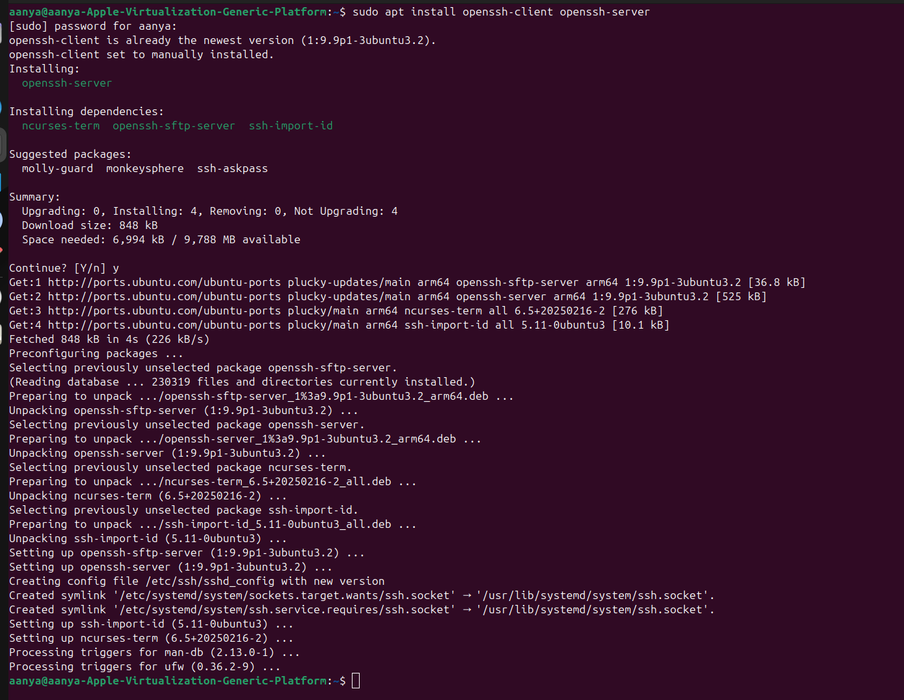
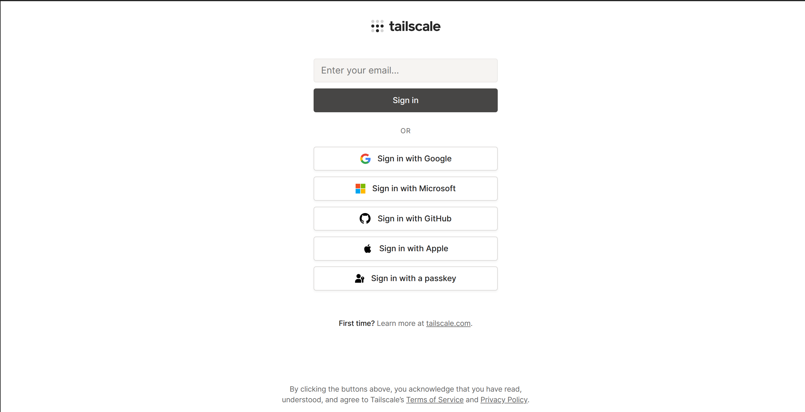

# SSH EXPERIMENT

The goal is to establish a **secure, encrypted, command-line connection** between your computer (the **client**) and your friend's Ubuntu computer (the **server**) over the local network.

# Connecting to same network
### 1\. Preparation on the Server (Your Friend's Ubuntu PC) 🧑‍💻

The target machine (your friend's PC) must have the SSH server software installed and running.

#### **A. Install OpenSSH Server**

1.  **Open a terminal** on your friend's PC.
2.  Run the following commands to ensure the package list is up-to-date and then install the SSH server:
    ```bash
    sudo apt update
    sudo apt install openssh-server
    ```

#### **B. Verify Service Status**

1.  The SSH service usually starts automatically after installation. Verify that it is running:
    ```bash
    sudo systemctl status ssh
    ```
2.  The output should show **`Active: active (running)`**. If it's not running, you can start it with:
    ```bash
    sudo systemctl start ssh
    ```

#### **C. Check Firewall (UFW)**

Ubuntu often uses the Uncomplicated Firewall (UFW). You need to ensure it allows SSH traffic (default port is 22).

1.  **Check UFW status:**
    ```bash
    sudo ufw status
    ```
2.  If the firewall is **active** and SSH is not allowed, enable it:
    ```bash
    sudo ufw allow ssh
    sudo ufw enable  # Only if it's currently inactive
    ```

#### **D. Find Local IP Address**

You need the server's internal network IP address (e.g., `192.168.1.5`).

1.  Run one of the following commands:
    ```bash
    ip addr show | grep 'inet ' | grep -v '127.0.0.1'
    # OR (on older systems)
    ifconfig | grep 'inet ' | grep -v '127.0.0.1'
    ```
    **Note down this IP address.**


### 2\. Connecting from the Client (Your Ubuntu PC) 🖥️

Your machine (the client) typically has the SSH client software installed by default, but it's good practice to ensure it's present.

#### **A. Verify OpenSSH Client**

1.  **Open a terminal** on your PC.
2.  Install the client if necessary (though it's usually pre-installed):
    ```bash
    sudo apt install openssh-client
    ```

#### **B. Connect via SSH**

Use the `ssh` command with the friend's username and the IP address you noted in step 1D.

1.  In your terminal, run the connection command:
    ```bash
    ssh your_friend_username@your_friend_ip_address
    ```
    *Example: `ssh jane@192.168.1.5`*
2.  **First-Time Connection:** You will be prompted to confirm the host's authenticity. Type **`yes`** and press Enter.
3.  **Enter Password:** You will then be prompted for the password for `your_friend_username` on the remote machine.
4.  If the password is correct, you will be successfully logged in, and your terminal prompt will change to reflect the remote machine.




> 📝 **Success\!** You now have terminal access to your friend's Ubuntu machine. You can run commands on their computer remotely. To exit the session, simply type **`exit`** and press Enter.

-----

# Connecting to different network

### **1. Setup (The "Tailnet" Creation)**

  * **Both you and your friend** must download and install the **Tailscale client** on your respective computers (it works across all major operating systems: Windows, macOS, Linux).
  
  * **Both of you** must sign up for a **free Tailscale account** (e.g., using Google, Microsoft, or GitHub SSO).
  
  * **Both of you** must log into the client app on your computer, which registers your device (a "node") on your new, private Tailscale network, or "tailnet."
  
      * *Note: For the free personal plan, your friend will likely need to be **invited as a user** to your tailnet (or you to theirs) so all the devices are on the same virtual network.*
      

### **2. Connecting (The Core Concept)**

Once both computers are connected and authorized on the same tailnet:

| Feature | Description |
| :--- | :--- |
| **Virtual IP Address** | Tailscale assigns each device a fixed, unique IP address (always in the `100.x.x.x` range). |
| **P2P Connection** | Tailscale uses the **WireGuard** protocol and NAT traversal techniques (like DERP and STUN) to establish an encrypted tunnel directly between your PC and your friend's PC. |
| **Bypassing the Router** | Because the connection is P2P and encrypted, you **do not** need to configure any port forwarding on either of your routers. |

### **3. Terminal Access via Tailscale IP**

1.  **Friend's PC (The Host):**

      * Ensure the **SSH server** is running (e.g., OpenSSH on Linux/macOS, or enabled on Windows).
      * Find their **Tailscale IP address** from the Tailscale client app or the web admin console (it will start with `100.`).

2.  **Your PC (The Client):**

      * Open your terminal and connect using the SSH client, but instead of the friend's public or local IP, use their **Tailscale IP address**:
        ```bash
        ssh username@friend_tailscale_ip_address
        ```
      * *Example:* `ssh jsmith@100.100.100.101`

### **4. Advanced (Optional): Tailscale SSH**

For an excellent mark, mention **Tailscale SSH**. This feature:

  * **Automates Key Management:** It uses your Tailscale identity for authentication, eliminating the need to manually create and manage traditional SSH keys.
  * **Centralized Control:** You can manage SSH access permissions from the Tailscale Admin Console's Access Control List (ACLs).

-----

| Traditional SSH over WAN | Tailscale SSH over WAN |
| :--- | :--- |
| **Requires** manual **Port Forwarding** on the router. | **Requires no** router configuration. |
| **Uses** the machine's dynamic **Public IP** (which can change). | **Uses** a fixed, private **Tailscale IP** (`100.x.x.x`). |
| **Security Risk:** Exposes a port (e.g., port 22) to the entire public internet. | **Security:** The port is only accessible to authorized devices on the private "tailnet." |

This approach shows you understand modern networking solutions and advanced security.


---

# 📝  SSH, Shell Scripting, and Secure Copy: A Command-Line Workflow for Remote Data Management

### **Abstract**

This report documents the process of establishing secure remote terminal access to a peer's computer across a different network (WAN) and demonstrates fundamental remote system administration tasks, specifically file creation and secure data transfer. The methodology employs **Tailscale** for secure network abstraction and **Secure Shell (SSH)** and **Secure Copy Protocol (SCP)** for command execution and authenticated data transfer.

-----

#### **I. Methodology: The Zero-Configuration Network (Tailscale)**

Traditional remote access across the Internet requires complex firewall and router configurations (**Port Forwarding**). This was bypassed using **Tailscale**, a modern Virtual Private Network (VPN) solution based on the WireGuard protocol.

##### **A. Tailscale Setup**

1.  **Tailnet Creation:** Both the client (my computer) and the host (my friend's computer) installed and logged into the Tailscale application, forming a single, encrypted virtual network (a "tailnet").
2.  **IP Abstraction:** Tailscale automatically assigned a persistent, fixed IP address in the `100.x.x.x` range to each machine, making the remote device accessible as if it were on the local network.
3.  **Security:** All traffic between the two nodes was automatically encrypted end-to-end, removing the security risk associated with opening ports to the public internet.

-----

#### **II. Phase 1: Terminal Access and Remote Command Execution**

The Secure Shell (SSH) protocol was used to gain command-line control over the remote machine.

##### **A. Establishing the Connection**

The client initiated the connection using the friend's assigned Tailscale IP address:

| Role | Command Syntax | Description |
| :--- | :--- | :--- |
| **Command** | `ssh [username]@[friend's Tailscale IP]` | Used the SSH client to connect securely. |
| **Example** | `ssh john_doe@100.100.100.101` | The connection was authenticated using the user's password or an SSH key. |


#### **B. Remote File Creation (Shell Scripting)**

Once logged into the remote terminal, a basic command was executed to create a file, simulating a task completed on the remote system:

| Task | Command Executed |
| :--- | :--- |
| **File Creation** | `echo "Assignment Status: Access Verified and File Created." > assignment_proof.txt` |
| **Verification** | `ls -l assignment_proof.txt` |
| **Output (Verification)** | *(Shows file size and timestamp)* |

-----

#### **III. Phase 2: Secure Data Retrieval (File Transfer)**

After creating the file remotely, the **Secure Copy Protocol (SCP)** was used to transfer the file securely back to the local machine, all over the encrypted Tailscale/SSH channel.

##### **A. SCP Command Execution**

SCP is a command-line utility that relies on SSH for security. The command was executed from the **local machine** (the client) to download the file from the remote machine (the server):

| Component | Command Syntax | Description |
| :--- | :--- | :--- |
| **Protocol** | `scp` | Invokes the Secure Copy utility. |
| **Source** | `[username]@[friend's Tailscale IP]:/path/to/remote/file` | Specifies the remote file to be copied. |
| **Destination** | `/path/to/local/destination/` | Specifies where the file should be saved on the local machine. |


##### **B. Example Command (Executed on Local PC)**

```bash
scp john_doe@100.100.100.101:~/assignment_proof.txt ./local_proofs/
```


-----

#### **IV. Protocol Analysis: SCP vs. SFTP**

While SCP was used for a quick file copy, two primary SSH-based protocols are available for file transfer.

| Feature | Secure Copy Protocol (**SCP**) | SSH File Transfer Protocol (**SFTP**) |
| :--- | :--- | :--- |
| **Purpose** | Simple, fast **file copying**. | Full **remote file system management** (create, delete, rename). |
| **Reliability** | **Less reliable:** Interruptions require a full restart. | **More reliable:** Supports resuming interrupted transfers. |
| **Interface** | Non-interactive, single command line. | Interactive, shell-like interface (`get`, `put`, `ls`). |
| **Use Case** | Ideal for automated scripts and quick file transfers. | Ideal for large files, complex remote directory navigation, and interactive file management. |
