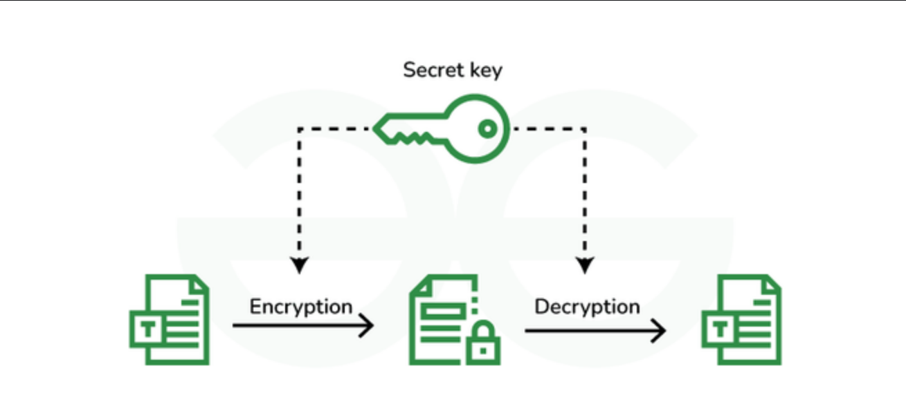
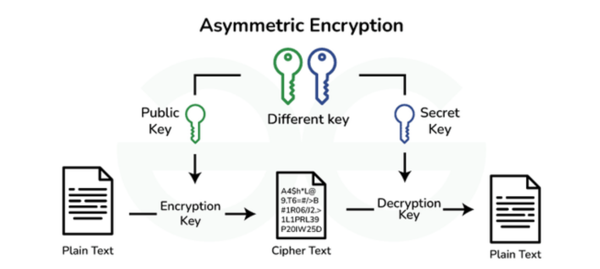
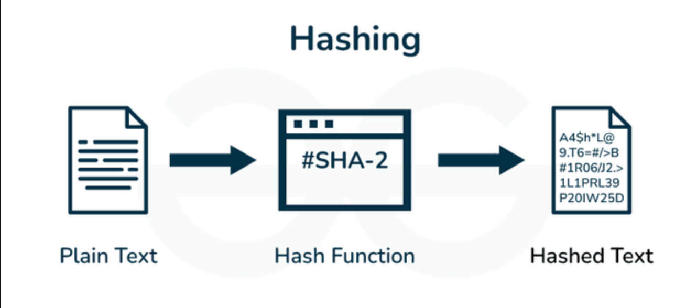
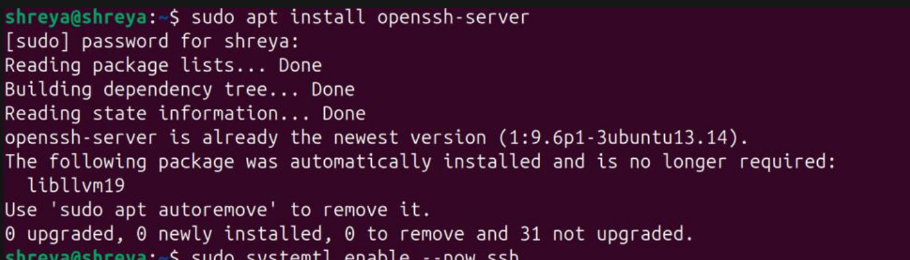
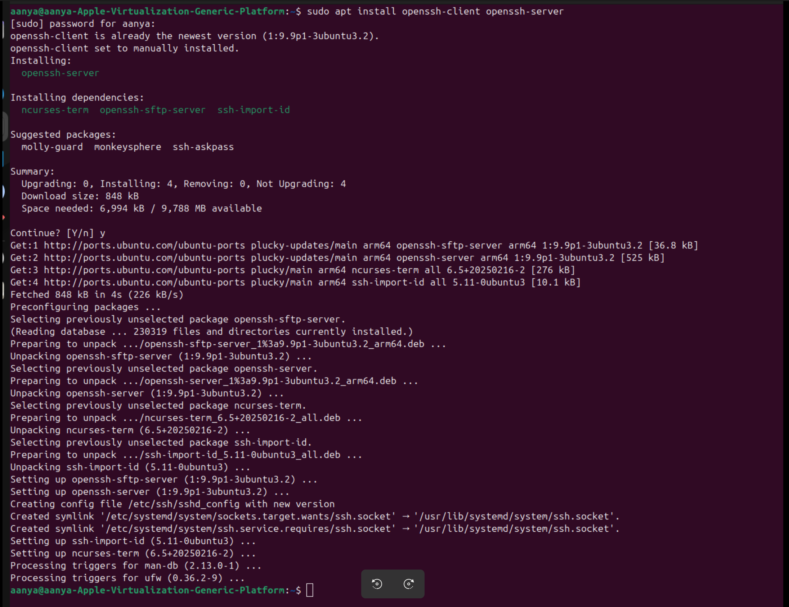
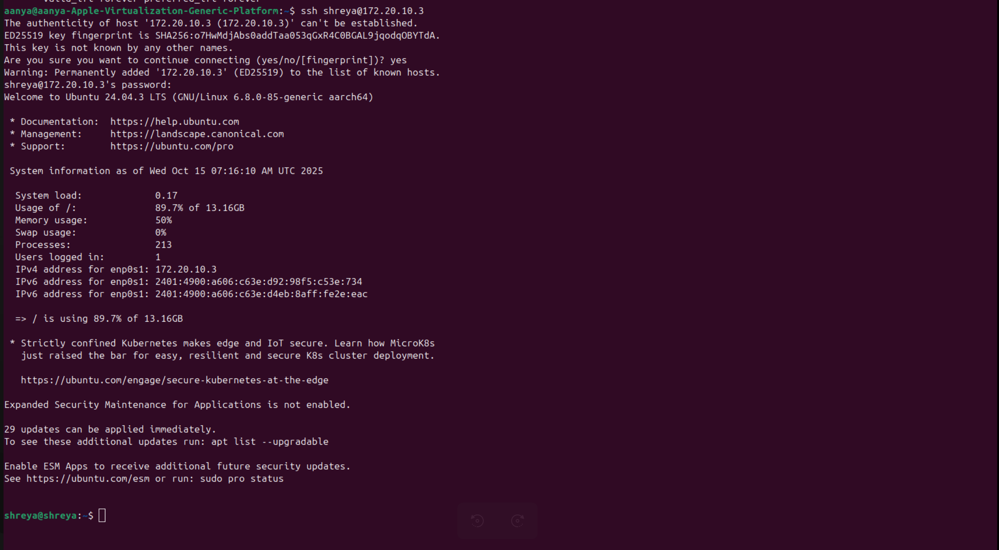
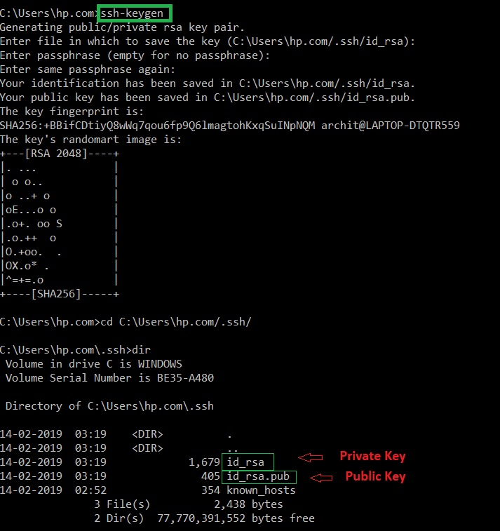

# SECURE SHELL LOGIN ACCESS
# How to do secure shell login on Linux ❔
Secure Shell (SSH) is a network protocol that allows you to securely connect to and control another computer (usually a remote server or a virtual machine) over a network.

Instead of physically using that machine’s keyboard and monitor, you log in from your own computer using a terminal.

---
## 🖥️ What is SSH?
SSH, or Secure Shell, constitutes a cryptographic network protocol designed to enable secure communication between two systems over networks that may not be secure. This protocol is widely employed for remote access to servers and the secure transmission of files between computers. In essence, SSH acts as a secure conduit, establishing a confidential channel for communication in scenarios where the network may pose security risks. This technology is instrumental for professionals seeking a reliable and secure method of managing servers and transferring sensitive data across computers in a controlled and protected manner. ssh runs at TCP/IP port 22. 

---

## Features of SSH

🔵 **Encryption:** Encrypted data is exchanged between the server and client, which ensures confidentiality and prevents unauthorized attacks on the system.

🔵 **Authentication:** For authentication, SSH uses public and private key pairs which provide more security than traditional password authentication.

🔵 **Data Integrity:** SSH provides Data Integrity of the message exchanged during the communication.

🔵 **Tunneling:** Through SSH we can create secure tunnels for forwarding network connections over encrypted channels.

---

## 📝 SSH Functions
There are multiple functions performed by SSH Function, here below are some functions:

◾️ SSH provides high security as it encrypts all messages of communication between client and server.

◾️ SSH provides confidentiality.

◾️ SSH allows remote login, hence is a better alternative to TELNET.

◾️ SSH provides a secure File Transfer Protocol, which means we can transfer files over the Internet securely.

◾️ SSH supports tunneling which provides more secure connection communication.

---

## 👩‍💻 Techniques Used in SSH
There are majorly three major techniques used in SSH, which are

◽️ **Symmetric Cryptography:** In Symmetric key cryptography the same key used for encrypting and decrypting the message, a unique single shared key is kept between the sender and reciever. For ex: DES (Data Encryption Standard) and AES (Advanced Encryption Standard).



◽️ **Asymmetric Cryptography:** In Asymmetric key cryptography the key used for encrypting is different from the key used for decrypting the message. For ex: RSA (Rivest–Shamir–Adleman) and Digital Signature Algorithm.



◽️ **Hashing:** Hashing is a procedure used in cryptography which convert variable length string to a fixed length string, this fixed length value is called hash value which is generated by hash function.



---

## ⚙️ Why SSH Login Is Needed
### `1.` **🛡️ Security**

SSH encrypts all data (like passwords, commands, and files) sent between two computers.

This prevents hackers from spying, modifying, or stealing information.

Unlike old protocols like Telnet, SSH is fully encrypted and safe for public networks.

### `2.` **💻 Remote Access**

You can control and manage remote servers or virtual machines from anywhere.
```bash
Example:

ssh user@192.168.1.10
```

lets you use that computer’s terminal as if you were sitting at it.

### `3.` **🔄 File Transfer & Management**

SSH supports secure file transfer tools like:

SCP (Secure Copy)

SFTP (Secure File Transfer Protocol)
```bash
Example:

scp file.txt user@server:/home/user/
```
### `4.`  **⚙️ System Administration**

System admins use SSH to:

Configure servers

Restart services

View logs

Install updates — all remotely

### `5.` **🧩 Automation & Development**

Developers and DevOps engineers use SSH to:

Connect to remote VMs, Raspberry Pis, or cloud instances (AWS, Azure, etc.)

Deploy apps and code securely

Run scripts remotely

### `6.` **🚀 Port Forwarding & Tunneling**

SSH can also securely tunnel other network traffic — e.g., for secure database or web access.

This is called SSH tunneling.

---

## ✏️ Prerequisites
Before delving into the world of SSH, it's essential to ensure that certain prerequisites are in place. Here's a checklist to guarantee a smooth connection:

🟣 **Remote Computer Status:**
Make sure the remote computer is turned on and has an active network connection. SSH relies on network connectivity, and the remote server needs to be accessible.

🟣 **Identification Information:**
Obtain the IP address or the name of the remote machine. This information is crucial for directing your SSH connection to the correct server.

🟣 **Permission to Access:**
Ensure that you have the necessary permissions to access the remote computer. This typically involves having a valid username and password for the remote server.

🟣 **Firewall Settings:**
Check the firewall settings on both your local machine and the remote server. SSH connections use a specific port (usually port 22), so it's crucial to ensure that your firewall allows SSH traffic. Adjustments may be required to permit secure communication.

---

## 🔌 Installing it on Both Client and Server
For Debian/Ubuntu-based Systems, open the terminal and run:
```bash
sudo apt install openssh-client openssh-server
```





## 📡 How to Use SSH to Connect to a Remote Server in Linux
In this example we access Ubuntu or Red hat Linux machine via the Windows command prompt using `ssh`

For example: If our IP address is "10.143.90.2" and username is "Jayesh"

Syntax to use ssh to connect to a remote server:
```bash
ssh jayesh@10.143.90.2
```



**command consists of 3 different parts:**

👉🏾 `ssh` command instructs the system to establish an encrypted secure connection with the host machine.

👉🏾 `user_name` represents the account that is being accessed on the host.

👉🏾 `host` refers to the machine which can be a computer or a router that is being accessed. It can be an IP address (e.g., 192.168.1.24) or domain e.g., www.domainname.com).

*Note:* After logging into the host computer, commands will work as if they were written directly to the host terminal. Using a public-private key pair or SSH key pair to login into the remote host is more secure as compared to using passwords. 

-----


## Options available is ssh

**Note:**  Here instead of user and host add username and IP address you want to connect to. And localhost is IP of our local system.

|Options|	Description |	Syntax|
|-------|---------------|---------|
|`-1`	 |Forces ssh to use protocol SSH-1 only.| ssh -1 user@host
|`-2`	 |Forces ssh to use protocol SSH-2 only.| ssh -2 user@host
|`-4`	 |Allows IPv4 addresses only.	        |ssh -4 user@host
|`-6`	 |Allows IPv6 addresses only.	            |ssh -6 user@host
|`-A`	|Authentication agent connection forwarding is enabled.	|ssh -A user@host
|`-a`	|Authentication agent connection forwarding is disabled.	|ssh -a user@host
|`-C`	|Compresses all data (including stdin, stdout, stderr, and data for forwarded X11 and TCP connections) for a faster transfer of data.	| ssh -C user@host
|`-c`	|Selects the cipher specification for encrypting the session. Specific cipher algorithm will be selected only if both the client and the server support it.	| ssh -c aes256-cbc user@host
|`-f`	|Requests ssh to go to background just before command execution.	|ssh -f user@host command
|`-g`	|Allows remote hosts to connect to local forwarded ports.	|ssh -g -L 8080:localhost:80 user@host
|`-n`	 |Prevents reading from stdin.	|ssh -n user@host command
|`-p`	 |Port to connect to on the remote host.	|ssh -p 2222 user@host
|`-q`	|Suppresses all errors and warnings	|ssh -q user@host
|`-V`	|Display the version number.	|ssh -V
|`-v`	 |Verbose mode. |It echoes everything it is doing while establishing a connection. It is very useful in the debugging of connection failures.	|ssh -v user@host
|`-X`	|Enables X11 forwarding (GUI Forwarding).	|ssh -X user@host

---

## SSH Keys
SSH keys are an essential component of Secure Shell (SSH) protocol, providing a more secure alternative to password-based logins.

### 🔑 What SSH Keys Are
An SSH key is a set of cryptographically secure digital credentials used to authenticate a client (like you) to a server or service (like a Git repository or a web host) without needing to enter a password.

The key system relies on public-key cryptography and consists of two parts:

🟩 **Public Key:**

- This key is safe to share.

- It is uploaded to the server or service you want to connect to.

- It's used to encrypt data that only the corresponding private key can decrypt.

- A typical format is a long string starting with ssh-rsa or ecdsa-sha2-nistp256.

🟩 **Private Key:**

- This key must be kept absolutely secret and secure on your local machine.

- It is used to decrypt data encrypted by the public key, proving your identity.

- It is often protected by a passphrase (an extra layer of security) that you must enter when using the key.

---

### 🌐 How the Authentication Works
The process works like a digital handshake:

When you attempt to connect, the server sends a challenge encrypted with the public key.

Your SSH client uses your private key to decrypt the challenge.

The client sends the decrypted, correct response back to the server.

The server verifies the response, confirming that you possess the corresponding private key, and grants access.

This system is significantly more secure than passwords because the private key never leaves your computer, and the key pair is nearly impossible to guess or brute-force.

---

### 📝 Common Uses of SSH Keys
🟩 **Remote Server Access:** Logging into Linux/Unix servers (e.g., AWS, DigitalOcean) without passwords.

🟩 **Version Control:** Authenticating with Git services like GitHub, GitLab, and Bitbucket for pushing and pulling code.

🟩 **Automation:** Securely running scripts or transferring files between machines using tools like scp or rsync.

🟩 **SSH Agent Forwarding:** Allowing you to use your private key on a "jump server" to authenticate to a third server without storing your private key on the jump server.

---

### How to create public-private keys?
```bash
ssh -keygen
```


---

## 🌐 Different Network Access (Wide Area Network - WAN)
Accessing a computer across the internet when it's behind a separate router (as is typical for home networks) is more complex due to Network Address Translation (NAT) and firewalls.

#### Methods for Different Network Access:
1. Port Forwarding (Traditional Method):

🟤 Friend's Router Setup: Your friend needs to configure their home router to forward an external port (e.g., a custom port like 2222) to the internal port 22 (the default SSH port) of their computer's local IP address.

🟤 Find Public IP Address: Your friend needs to find their network's public IP address (they can search "What is my IP" on Google).

🟤 Your PC Connects: You connect using SSH to their public IP and the forwarded port:

```bash

ssh username@friend_public_ip_address -p 2222
```
Note: Public IP addresses can sometimes change (Dynamic IP), which requires using a Dynamic DNS (DDNS) service to maintain a persistent hostname.

2. VPN (Virtual Private Network):

Both your friend's PC and your PC connect to a third-party VPN server or a dedicated self-hosted VPN server (e.g., OpenVPN, WireGuard).

Once connected to the same VPN, the computers act as if they are on the same private network, and you can use the SSH method for the same network with the IP address assigned by the VPN.

3. Third-Party Tunneling/Sharing Tools (Easiest Option for the End-User):

Tools like Teleconsole, tailscale or tmate (mentioned above) are designed to make this easy by creating a temporary, secure tunnel that bypasses the need for manual port forwarding. Your friend runs a command, gets a unique ID or link, and shares it with you to join the session.

Using SSH with port forwarding is the most foundational and common remote terminal access method for this type of assignment.

## 👑 Conclusion 
In this article we discussed Secure Shell (SSH) which is like a secret, safe tunnel for computers to talk securely over the internet. This guide is for beginners, helping them use SSH to connect their computer to faraway servers in the Linux world. It covers everything from the basic SSH command to prerequisites like checking your internet connection and having the right permissions. You'll learn how to install SSH on Linux, create secure keys, and use them for safer logins. The article also includes frequently asked questions with simple answers, making sure you can confidently and securely manage remote servers using SSH in Linux. It's like giving your computer a secret code to talk safely on the internet!

---